# 4-Bit Calculator 1 
---

## 4-Bit Adder/Subtractor

Create a circuit for addition and subtraction, the most basic operations in arithmetic.

It is a circuit that designs adder and subtractor using 4-bit adder circuit.
Addition and subtraction are determined by CTR signal. When CTR signal is 0, 

 
 
it operates as an adder, and when CTR signal is 1, it operates as a subtractor.

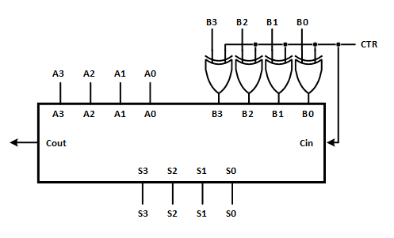

 
 

In this circuit, if the value of A - B is negative number, it is expressed as complement value of 2.

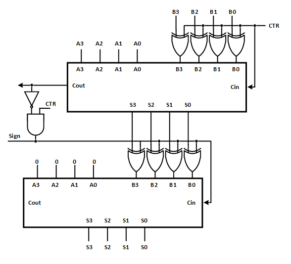 

Calculate the value of adding A and B and subtracting B from A using 4-bit Adder. Even if value B is greater than value A and negative number is produced, the calculated value is expressed with a sign.

 

Devices connected and pin numbers connected to the device to check in SACT equipment are as below.

|PORT NAME|CTR|
|:-:|:-:|
|HARDWARE|SW7|
|PIN NUMBER|W8|

|PORT NAME|A[3]|A[2]|A[1]|A[0]|
|:-:|:-:|:-:|:-:|:-:|
|HARDWARE|S7|S6|S5|S4|
|PIN NUMBER|Y6|W7|AB6|AA7|

|PORT NAME|B[3]|B[2]|B[1]|B[0]|
|:-:|:-:|:-:|:-:|:-:|
|HARDWARE|S3|S2|S1|S0|
|PIN NUMBER|Y7|V8|AB7|Y8|

|PORT NAME|SIGN|COUT|S[3]|S[2]|S[1]|S[0]|
|:-:|:-:|:-:|:-:|:-:|:-:|:-:|
|HARDWARE|LED7|LED6|LED5|LED4|LED3|LED2|
|PIN NUMBER|W2|Y1|Y2|Y3|AA3|AB3|

 

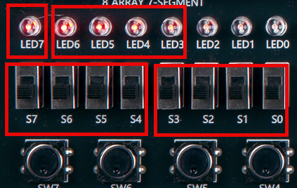

### **Design**

1. Select File > New Project Wizard in Quartus to create new project.

2. Set Directory, Name, and Top-Level Entry window as below.

    |Working Directory|d:\work\ADD_SUB_4|
    |-|-|
    |project Name | ADD_SUB_4|
    |Top Level Entry Name | ADD_SUB_4|

3. Set Project Type to Empty project, and do not set Add File window.

4. In Family, Device&Board Setting window, first set Device Family/Package/Pin Count/Core speed grade as shown below, and then set Name.

    |Device Family|Cyclone 10 LP|
    |-|:-:|
    |Package|FBGA|
    |Pin count|484|
    |Core Speed grade|8|
    |Available devices|10CL080YF484C8G|

      

>Be careful that if device name changes, programming is not possible.

5. Do not set ‘EDA Tool Settings’.

    Check Summary to confirm the current settings and click Finish to complete project creation.

6. Let's use P_ADD_SUB logic circuit, 4-bit adder/subtractor logic circuit previously created in Combination Logic. 
    
    Copy HA.bdf, HA.bsf, HAFA.bdf, HAFA.bsf, P_ADD_SUB.bdf files from the previous P_ADD_SUB working directory to the current working directory ADD_SUB_4.    

> Since P_ADD_SUB is a separately created circuit, it must be included in the project folder. If not, error message that there is no file when compiling will come out.

 

7. Import copied P_ADD_SUB4.bdf file in File > Open menu.

    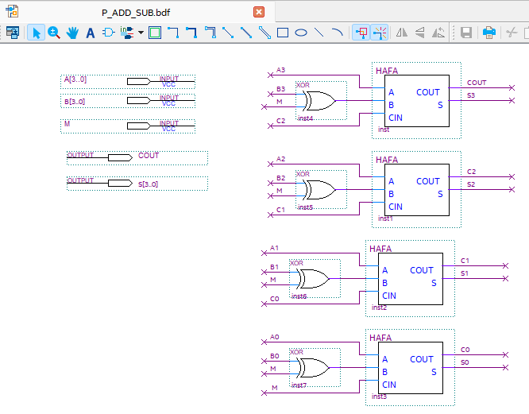  

> Load the upper logic circuit and make it into a symbol.

8. Create symbol file for the currently loaded logic circuit by selecting File > Create / Update > Create Symbol Files for Current File as shown below.
    
    This is because symbol must be used when designing a logic circuit using Schema.

9. Click the File > New menu to open the New window and select Block Diagram/Schematic File.

10. Right-click on the drawing and select Insert > Symbol menu (double-click on the drawing). Import input symbol, output symbol, gnd symbol, P_ADD_SUB  symbol and place them on the drawing.

    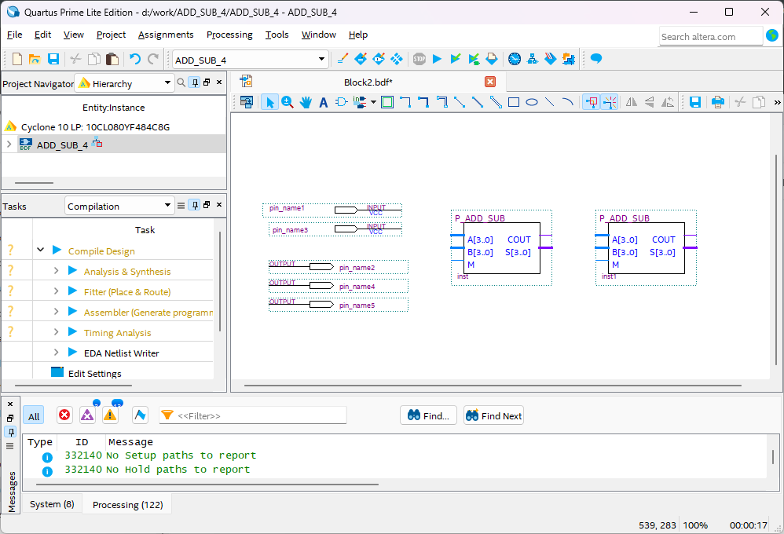  

11. Complete the drawing by modifying the names of input and output, adding more symbols and connecting the symbols with wire as shown below.

    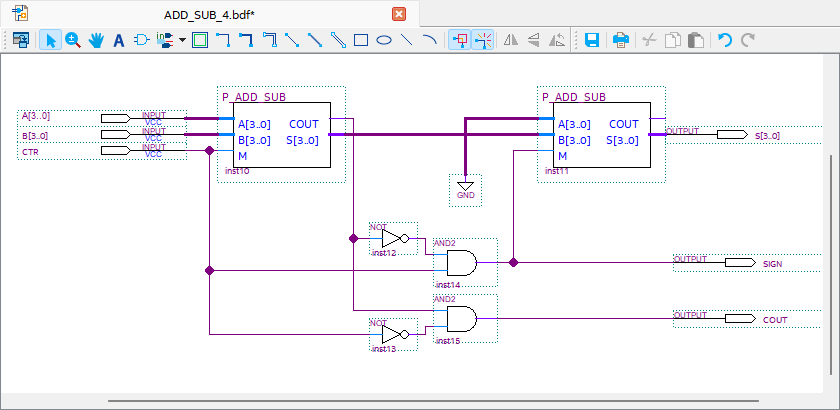  

12. Save. Set file name to the project name (default setting).

### **Compile**

13. Select Processing > Start Compilation menu to start compilation.

    This is the process of checking for errors in the design and synthesizing/ generating timing information / generating programming file.

### **Simulation**

14. Once compilation is complete, start simulation.

    Select File > New and select “University Program VWF” under Verification/Debugging Files in New window that appears.

15. In Simulation Waveform Editor window, select Edit > Insert > Insert Node or Bus.

16. Press Node Finder button, press List button in Node Finder window, and press “>>” button in Nodes Found. Then, click OK button to add input/output port to Simulation Waveform Editor window.

17. In Simulation Waveform Editor window, drag and select some of port A with the mouse and press ? icon to enter the data of the input condition. Enter data into port B in the same way.

    Set CTR value by pressing icon 0 or icon 1.

    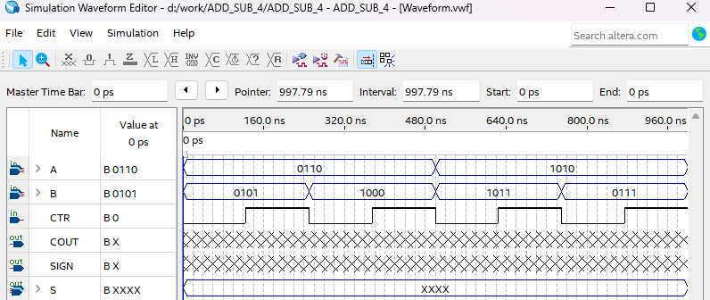  

18. SAVE. Leave the file name as default.

19. Select Simulation > Simulation Setting menu and delete “ –novopt” in the window that appears.

      

>If this “-novopt’ is not deleted, the following message will appear upon the simulation.

     

20. Select Simulation > Run Functional Simulation menu to run the simulation.

    Simulation results show that addition result for A and B data when CTR is 0 and subtraction result for A and B data when CTR is 1.

    COUT comes when overflow occurs in addition, and Sign comes when B is greater than A in subtraction.

   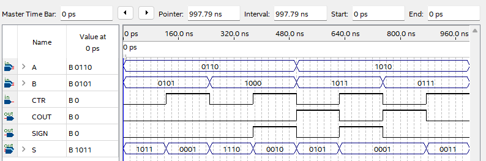  
     
    It is difficult to understand at a glance because it is displayed in binary.
      
    Select input port A and input port B and output S with the mouse and select Edit > Radix > Unsigned Decimal to display the simulated result in decimal as below.
      
    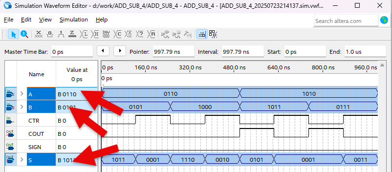  
    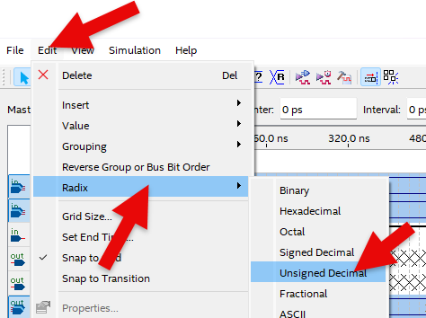  
    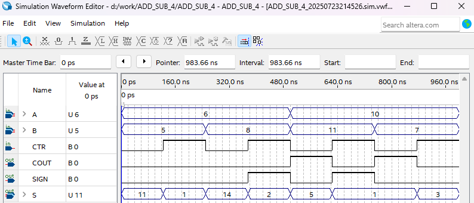  

### Device & Pin Assignment

21. After predicting the operation of designed logic circuit through simulation, let’s verify the operation of the hardware through equipment.
To check the equipment, set the pin for input/output port.

22. Select Assignment > Device.

    In the Device Settings window that appears, click ‘Device and Pin Options’ button.

23. In ‘Device & Pin Option’ window, select “Unused Pins” category and set “Reserve all unused pins” to “As output driving ground”.
    
    It is because that default setting is “As input tri-stated with weak pull-up”, which causes the pins not set to be slightly pulled up, in High state.
    
    Since there are many elements such as LED configured in the equipment, if ‘As output driving ground’ is not set, unset LED may turn ON causing output result confusing. Therefore, it is recommended to set Unused Pin as ‘As output driving ground’.

      
 

24. Select Assignment > Pin Planner and set PIN number.

25. Set PIN number in Location as shown in the table below.

    If PIN number is set differently, it will be difficult to check the operation of the device.

|PORT NAME|CTR|
|:-:|:-:|
|HARDWARE|SW7|
|PIN NUMBER|W8|

|PORT NAME|A[3]|A[2]|A[1]|A[0]|
|:-:|:-:|:-:|:-:|:-:|
|HARDWARE|S7|S6|S5|S4|
|PIN NUMBER|Y6|W7|AB6|AA7|

|PORT NAME|B[3]|B[2]|B[1]|B[0]|
|:-:|:-:|:-:|:-:|:-:|
|HARDWARE|S3|S2|S1|S0|
|PIN NUMBER|Y7|V8|AB7|Y8|

|PORT NAME|SIGN|COUT|S[3]|S[2]|S[1]|S[0]|
|:-:|:-:|:-:|:-:|:-:|:-:|:-:|
|HARDWARE|LED7|LED6|LED5|LED4|LED3|LED2|
|PIN NUMBER|W2|Y1|Y2|Y3|AA3|AB3|

 

26. After setting the pin, close the window and select Processing > Start Compilation menu to proceed with compilation.

    This is to create a programming file that includes Device option and Pin configuration information.

  
    
### **Check Hardware Operation**

27. Prepare SACT equipment. Connect USB cable and power cable and press the power switch to supply power to the device.

28. In Quartus software, select Tool > Programmer.

29. Check that USB Blaster is connected in Hardware Setup on Programmer window. Press Start button to program to check the operation on the device.

30. Set the value of A and B by moving the slide switch S7-S4, S3-S0. Check the result of addition or subtraction through LED using button switch SW7.

|PORT NAME|CTR|
|:-:|:-:|
|HARDWARE|SW7|

|PORT NAME|A[3]|A[2]|A[1]|A[0]|
|:-:|:-:|:-:|:-:|:-:|
|HARDWARE|S7|S6|S5|S4|

|PORT NAME|B[3]|B[2]|B[1]|B[0]|
|:-:|:-:|:-:|:-:|:-:|
|HARDWARE|S3|S2|S1|S0|

|PORT NAME|SIGN|COUT|S[3]|S[2]|S[1]|S[0]|
|:-:|:-:|:-:|:-:|:-:|:-:|:-:|
|HARDWARE|LED7|LED6|LED5|LED4|LED3|LED2|

 

 

