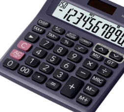

# 4bit Calculator
---

## Planning

In the previous Combination Logic, we practiced controlling adder and subtractor.

In this project, we will design a circuit that outputs the results of addition, subtraction, multiplication, division for 4-bit input data of A and B.

 

 

The equipment consists of 8 Slide Switches. Design a circuit that places A and B in S7-S4 and S3-S0, respectively, receives input and displays operation results of A and B on LED by button switch input.

 

## [9-1. 4bit Adder / Subtractor](./9-1.Add_Sub.md)

## [9-2. 4bit Multiplier](./9-2.Multiplexer.md)

## [9-3. 4bit Divider](./9-3.Divider.md)

## [9-4. 4bit Calculator](./9-4.4bit%20Calculator.md)

