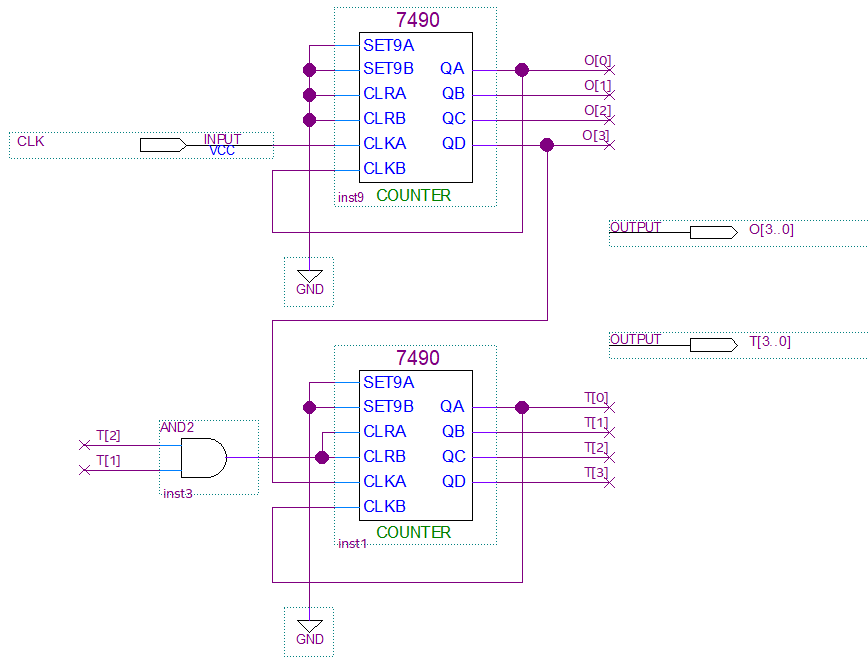

# WATCH 1
---

## Minute/Second Counter 

For digital watch, second/minute/hour are counted in 1-second cycle.
The practice example only counts second and minute.

Let’s design the circuit that counts from 0 to 59 by dividing into 1-digit 09 counter and 10-digit 0-5 counter.

This is because when designing a circuit that counts from 0 to 59, circuit to divide the number into 1st and 10th digit to display the number must be added.

The following is MOD10 counter circuit using 7490 practiced previously.
 
  
 

  

MOD10 counter circuit using 7490 can be designed as below.

  

Circuit that counts from 0 to 59 can be designed by connecting these two circuits.

  

 

Devices connected and pin numbers connected to the device to check in SACT equipment are as below.

|PORT NAME|CLK|
|:-:|:-:|
|HARDWARE|Main Clock|
|PIN NUMBER|G2|

|PORT NAME|T[3]|T[2]|T[1]|T[0]|O[3]|O[2]|O[1]|O[0]|
|:-:|:-:|:-:|:-:|:-:|:-:|:-:|:-:|:-:|
|HARDWARE|LED7|LED6|LED5|LED4|LED3|LED2|LED1|LED0|
|PIN NUMBER|W2|Y1|Y2|Y3|AA3|AB3|Y4|AA4|

 

  

### **Design**

1. Select File > New Project Wizard in Quartus to create new project.

2. Set Directory, Name, and Top-Level Entry window as below.

    |Working Directory|d:\work\CNT59|
    |-|-|
    |project Name | CNT59|
    |Top Level Entry Name | CNT59|

3. Set Project Type to Empty project, and do not set Add File window.

4. In Family, Device&Board Setting window, first set Device Family/Package/Pin Count/Core speed grade as shown below, and then set Name.

    |Device Family|Cyclone 10 LP|
    |-|:-:|
    |Package|FBGA|
    |Pin count|484|
    |Core Speed grade|8|
    |Available devices|10CL080YF484C8G|

      

>Be careful that if device name changes, programming is not possible.

5. Do not set ‘EDA Tool Settings’.

    Check Summary to confirm the current settings and click Finish to complete project creation.

6. Click File > New menu to open New window and select Block Diagram/Schematic File.

7. Right-click on the drawing and select Insert > Symbol menu (double-click on the drawing). Import input symbol, output symbol, 7490 symbol and place them on the drawing.

8. Complete the drawing by modifying the names of input and output, adding more symbols and connecting the symbols with wire as shown below.
 

      

9. Save. Set file name to project name (default setting).

### **Compile**

10. Select Processing > Start Compilation menu to start compilation.

    This is the process of checking for errors in the design and synthesizing/ generating timing information / generating programming file.

### **Simulation**

11. Once compilation is complete, start simulation.

    Select File > New and select “University Program VWF” under Verification/Debugging Files in New window that appears.

12. In Simulation Waveform Editor window, select Edit > Insert > Insert Node or Bus.

13. Press Node Finder button, press List button in Node Finder window, and press “>>” button in Nodes Found. Then, click OK button to add input/output port to Simulation Waveform Editor window.

14. In Simulation Waveform Editor window, select CLK with the mouse to select the entire input CLK and select [clock] icon above to set the Period to 10 ns.

 
      

15. SAVE. Leave the file name as default.

16. Select Simulation > Simulation Setting menu and delete “ –novopt” in the window that appears.

      

> 
If this “-novopt’ is not deleted, the following message will appear upon the simulation.

     

17. Select Simulation > Run Functional Simulation menu to run the simulation.

     
     
    The data above is displayed in binary format, making it difficult to understand at a glance.
      
    Select input port A and input port B and output S with the mouse. Select Edit > Radix > Unsigned Decimal to display the simulated results in decimal.
      
    Click the icon below to enlarge the screen to see data more precisely.
      
      

### Device & Pin Assignment

18. After predicting the operation of designed logic circuit through simulation, let’s verify the operation of the hardware through equipment.

    To check the equipment, set the pin for input/output port.

19. Select Assignment > Device.

    In the Device Settings window that appears, click ‘Device and Pin Options’ 

20. In ‘Device & Pin Option’ window, select “Unused Pins” category and set “Reserve all unused pins” to “As output driving ground”.
    
    It is because that default setting is “As input tri-stated with weak pull-up”, which causes the pins not set to be slightly pulled up, in High state.
    
    Since there are many elements such as LED configured in the equipment, if ‘As output driving ground’ is not set, unset LED may become ON causing output result confusing. Therefore, it is recommended to set Unused Pin as ‘As output driving ground’.
 

      
 

21. Select Assignment > Pin Planner to set PIN number.

22. Set PIN number in Location as shown in the table below.
If PIN number is set differently, it will be difficult to check the operation of the device.

|PORT NAME|CLK|
|:-:|:-:|
|HARDWARE|Main Clock|
|PIN NUMBER|G2|

|PORT NAME|T[3]|T[2]|T[1]|T[0]|O[3]|O[2]|O[1]|O[0]
|:-:|:-:|:-:|:-:|:-:|:-:|:-:|:-:|:-:|
|HARDWARE|LED7|LED6|LED5|LED4|LED3|LED2|LED1|LED0|
|PIN NUMBER|W2|Y1|Y2|Y3|AA3|AB3|Y4|AA4|

 

 
 

23. After setting the pin, close the window and select Processing > Start Compilation menu to proceed with compilation. 

    This is to create a programming file that includes Device option and Pin configuration information.

  
    
### **Check Hardware Operation**

24. Prepare SACT equipment. Connect USB cable and power cable and press the power switch to supply power to the device.

25. In Quartus software, select Tool > Programmer.

26. Check that USB Blaster is connected in Hardware Setup on Programmer window. Press Start button to program to check the operation on the device.

27. Set to 1Hz using CLOCK SELECT SWITCH of CLOCK block and check the LED operation.

|PORT NAME|CLK|
|:-:|:-:|
|HARDWARE|Main Clock|

|PORT NAME|T[3]|T[2]|T[1]|T[0]|O[3]|O[2]|O[1]|O[0]
|:-:|:-:|:-:|:-:|:-:|:-:|:-:|:-:|:-:|
|HARDWARE|LED7|LED6|LED5|LED4|LED3|LED2|LED1|LED0|
|PIN NUMBER|W2|Y1|Y2|Y3|AA3|AB3|Y4|AA4|

 

 

