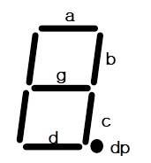
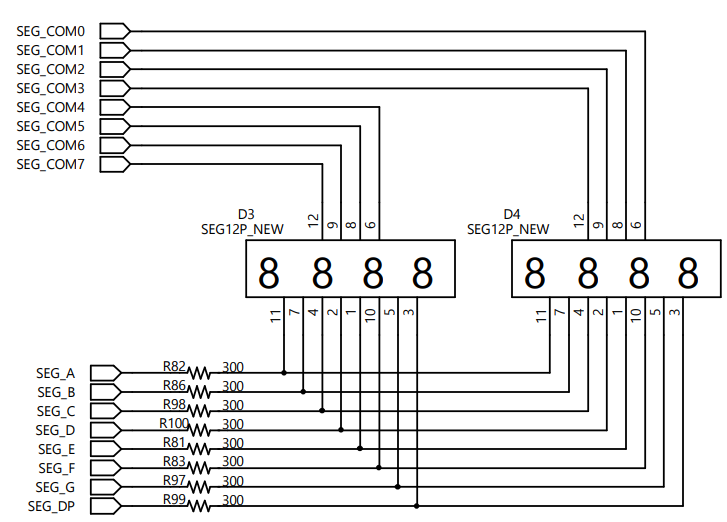
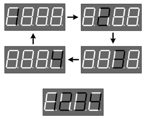
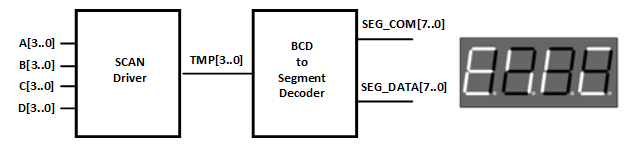
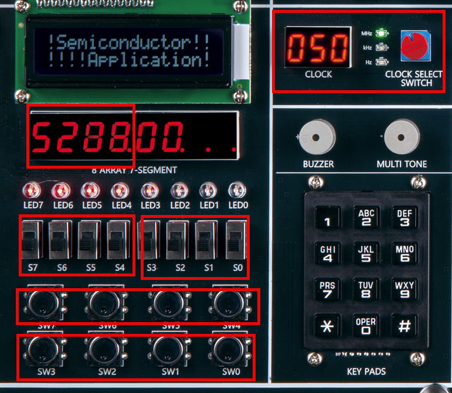
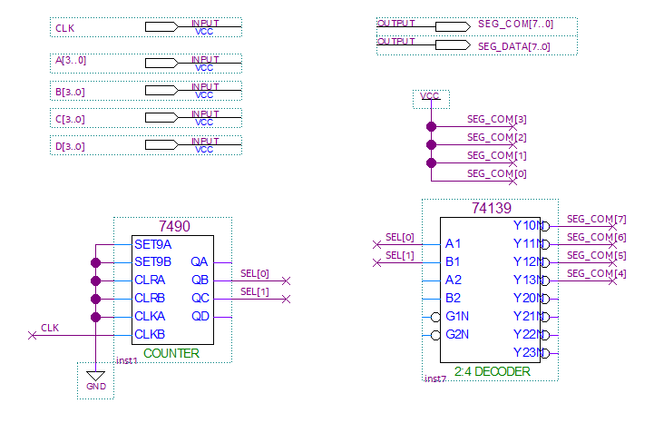
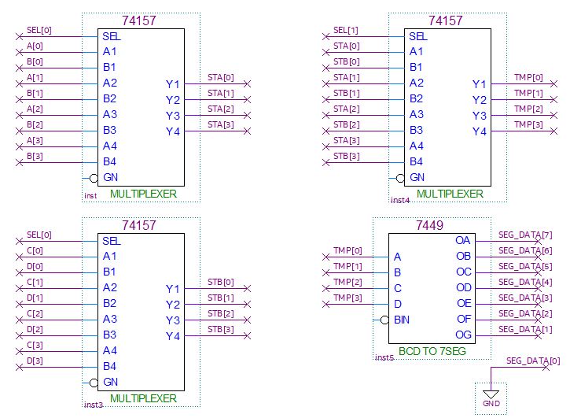

# WATCH 2
---

## 7-Segment Array 제어기 Design

앞의 Combination Logic에서 BCD to 7-Segment 디코더를 이용하여 7-Segment를 제어하는 실습을 진행하였었다. 

 

아래 그림은 7-Segment의 데이터 라인을 표시하는 것이다. 

  

이 8개의 데이터 라인을 제어하여 다음 그림과 같은 문자를 표시할 수 있7다. 

  

아래 표는 위의 문자를 표시하기 위한 데이터를 나타낸 표이다. 

|Display||a|b|c|d|e|f|g|dp|
|:---:|:---:|:---:|:---:|:---:|:---:|:---:|:---:|:---:|:---:|
|0||1|1|1|1|1|1|0|0|
|1||0|1|1|0|0|0|0|0|
|2||1|1|0|1|1|0|1|0|
|3||1|1|1|1|0|0|1|0|
|4||0|1|1|0|0|1|1|0|
|5||1|0|1|1|0|1|1|0|
|6||1|0|1|1|1|1|1|0|
|7||1|1|1|0|0|0|0|0|
|8||1|1|1|1|1|1|1|0|
|9||1|1|1|1|0|1|1|0|
|A||1|1|1|0|1|1|1|0|
|B||0|1|1|1|1|0|0|0|
|C||1|0|0|1|1|1|0|0|
|D||0|1|1|1|1|0|1|0|
|E||1|0|0|1|1|1|1|0|
|F||1|0|0|0|1|1|1|0|

장비에 구성된 7-Segment Array는 다음과 같이 구성되어 있다. 
 

  

장비의 7-Segment는 아래와 같이 Array 구조를 갖고 있다. 
 

1개의 7-Segment를 제어하기 위해서는 8개의 데이터 라인이 필요한데, 이렇게 되면 8개의 7-Segment를 제어하기 위해서는 8 x 8 = 64개의 데이터 라인이 필요하다. 

이렇게 되면 IO의 자원을 낭비하기 때문에 위의 회로와 같이 8개의 7-Segment의 데이터 라인을 공유하고, 각각의 Common 단자도 제어하는 방식으로 구성한다. 

이렇게 구성하면 16개의 데이터 라인만 필요하다. 

다만 이렇게 하기 위해서는 별도의 7-Segment Array제어 회로가 필요하다. 

 

다음은 7-Segment Array에 [1 2 3 4]를 표시하는 설명을 그림으로 나타낸 것이다. 

  

- 4자리의 7-Segment Array를 제어하는데, 필요한 데이터 라인을 SEG_COM[3..0]과 SEG_DATA[7..0]이라 정의한다. 

- 첫 번째 자리의 7-Segment common 단자를 SEG_COM[3]로 정의하며 순서대로, SEG_COM[2], SEG_COM[1], SEG_COM[0]이다. 

- 7-Segment의 데이터는 a, b, c, d, e, f, g, dp인데 각각 SEG_DATA[7], SEG_DATA[6], ... , SEG_DATA[1], SEG_DATA[[0]이다. 

- 첫 번째 7-Segment에 1의 문자를 표시하기 위해 SEG_COM[3..0]에는 0111의 값이 전달되어야 하고, SEG_DATA에는 "011000000"의 데이터가 전달되어야 한다. 

- 두 번째 7-Segment에 2의 문자를 표시하기 위해 SEG_COM[3..0]에는 1011의 값이 전달되어야 하고, SEG_DATA에는 "11011010"의 데이터가 전달되어야 한다. 

- 세 번째 7-Segment에 3의 문자를 표시하기 위해 SEG_COM[3..0]에는 1111의 값이 전달되어야 하고, SEG_DATA에는 "11110010"의 데이터가 전달되어야 한다. 

- 네 번째 7-Segment에 4의 문자를 표시하기 위해 SEG_COM[3..0]에는 1110의 값이 전달되어야 하고, SEG_DATA에는 "01100110"의 데이터가 전달되어야 한다. 

- 4개의 데이터가 순서대로 표시되는데, 이 속도를 빨리하면 동시에 4개의 데이터가 모두 표시되는 것으로 나온다. 

  

실습해볼 예제는 다음과 같다. 

A, B, C, D의 4비트 데이터 입력을 받아, 4개의 7-Segment에 입력된 BCD값을 표시하는 예제이다. 

  

 

SACT 장비에서 확인하기 위하여 연결된 장치와 장비에 연결된 핀 번호는 다음과 같다. 

|PORT NAME|CLK|
|:-:|:-:|
|HARDWARE|Main Clock|
|PIN NUMBER|G2|

|PORT NAME|A[3]|A[2]|A[1]|A[0]|
|:-:|:-:|:-:|:-:|:-:|
|HARDWARE|S7|S6|S5|S4|
|PIN NUMBER|Y6|W7|AB6|AA7|

|PORT NAME|B[3]|B[2]|B[1]|B[0]|
|:-:|:-:|:-:|:-:|:-:|
|HARDWARE|S3|S2|S1|S0|
|PIN NUMBER|Y7|V8|AB7|Y8|

|PORT NAME|C[3]|C[2]|C[1]|C[0]|
|:-:|:-:|:-:|:-:|:-:|
|HARDWARE|SW7|SW6|SW5|SW4|
|PIN NUMBER|W8|AB8|AA8|V9|

|PORT NAME|D[3]|D[2]|D[1]|D[0]|
|:-:|:-:|:-:|:-:|:-:|
|HARDWARE|SW3|SW2|SW1|SW0|
|PIN NUMBER|U9|AB9|AA9|V10|

|PORT NAME|SEG_COM[7]|SEG_COM[6]|SEG_COM[5]|SEG_COM[4]|
|:-:|:-:|:-:|:-:|:-:|
|HARDWARE|SEG_COM[7]|SEG_COM[6]|SEG_COM[5]|SEG_COM[4]|
|PIN NUMBER|U1|T5|T4|T3|

|PORT NAME|SEG_COM[3]|SEG_COM[2]|SEG_COM[1]|SEG_COM[0]|
|:-:|:-:|:-:|:-:|:-:|
|HARDWARE|SEG_COM[3]|SEG_COM[2]|SEG_COM[1]|SEG_COM[0]|
|PIN NUMBER|R5|R4|R3|R2|

|PORT NAME|SEG_DATA[7]|SEG_DATA[6]|SEG_DATA[5]|SEG_DATA[4]|
|:-:|:-:|:-:|:-:|:-:|
|HARDWARE|SEG_A|SEG_B|SEG_C|SEG_D|
|PIN NUMBER|R1|P5|P4|R3|

|PORT NAME|SEG_DATA[3]|SEG_DATA[2]|SEG_DATA[1]|SEG_DATA[0]|
|:-:|:-:|:-:|:-:|:-:|
|HARDWARE|SEG_E|SEG_F|SEG_G|SEG_DP|
|PIN NUMBER|P2|P1|N6|N5|

 

  

### **Design**

1. 실험을 위해 Quartus의 File > New Project Wizard 메뉴를 선택하여 새 프로젝트 생성한다. 

2. Directory, Name, Top-Level Entry 창을 다음과 같이 설정한다. 

    |Working Directory|d:\work\SEG_DISP|
    |-|-|
    |project Name | SEG_DISP|
    |Top Level Entry Name | SEG_DISP|

3. Project Type을 Empty project로 설정하고, Add File 창은 별다른 설정을 하지 않는다. 

4. Family, Device & Board Setting 창에서 먼저 아래와 같이 Device Family/Package /Pin Count/Core speed grade를 설정하고, Name를 설정한다. 

    |Device Family|Cyclone 10 LP|
    |-|:-:|
    |Package|FBGA|
    |Pin count|484|
    |Core Speed grade|8|
    |Available devices|10CL080YF484C8G|

      

>디바이스의 Name이 달라지면, Programming이 되지 않기 때문에 주의해야 한다. 

5. EDA Tool Settings도 별다른 설정을 하지 않는다. 

    Summary를 확인해 지금 설정된 내용을 확인한 후, Finish를 눌러 프로젝트 생성을 마친다. 

6. File > New 메뉴를 눌러서 New 창을 불러온 후, Block Diagram/Schematic File을 선택한다.

7. 도면에서 마우스의 오른쪽 버튼을 눌러 Insert > Symbol 메뉴를 선택(도면을 마우스로 더블 클릭 해도 됨.)하여, 심볼을 추가하여 다음 그림과 같이 논리 회로를 완성시킨다. 

      
      

8. Save 한다. 이 때, 파일명을 Project 명(기본 설정)으로 설정한다. 

### **Compile**

9. Processing > Start Compilation 메뉴를 선택하여, Compile을 진행한다. 

    설계된 부분의 오류가 있는지를 검사하고, 합성 / 타이밍 정보 생성 / 프로그래밍 파일 생성 을 하는 과정이다. 

### Device & Pin Assignment

10. 장비를 통해서 하드웨어의 동작을 확인해 보아야 한다. 

    장비를 확인하기 위해서, 입출력 포트에 대한 핀을 설정해 주어야 한다. 
 

11. 먼저 Assignment > Device 항목을 선택한다. 

    나타난 Device 설정 창에서 Device and Pin Options 버튼을 누른다. 
   
12. Device & Pin Option 창에서 Unused Pins 카테고리를 선택하고, Reserve all unused pins를 As output driving ground로 설정한다. 

    이렇게 하는 이유는 기본 설정 값이 As input tri-stated with weak pull-up 인데, 이렇게 할 때 설정하지 않은 핀들이 약간의 pull-up 상태 즉 High의 상태가 된다. 

    장비에 구성된 LED등의 요소가 많기 때문에, As output driving ground로 설정하지 않으면 설정하지 않은 LED에 ON되어 출력된 결과에 혼동이 올 수 있다. 그래서 왠만하면 Unused Pin을 As output driving ground로 설정 해 주는 것이 좋다. 

      
 

13. Assignment > Pin Planner 메뉴를 선택하여 핀 번호를 설정한다. 

14. 핀 번호는 Location 부분에 아래 표와 같이 핀 번호를 설정해 주면 된다. 

    핀 번호를 다르게 설정하면, 장비에서 동작을 확인하기 어렵기 때문에 핀 번호를 일치시켜 줘야 한다. 

|PORT NAME|CLK|
|:-:|:-:|
|HARDWARE|Main Clock|
|PIN NUMBER|G2|

|PORT NAME|A[3]|A[2]|A[1]|A[0]|
|:-:|:-:|:-:|:-:|:-:|
|HARDWARE|S7|S6|S5|S4|
|PIN NUMBER|Y6|W7|AB6|AA7|

|PORT NAME|B[3]|B[2]|B[1]|B[0]|
|:-:|:-:|:-:|:-:|:-:|
|HARDWARE|S3|S2|S1|S0|
|PIN NUMBER|Y7|V8|AB7|Y8|

|PORT NAME|C[3]|C[2]|C[1]|C[0]|
|:-:|:-:|:-:|:-:|:-:|
|HARDWARE|SW7|SW6|SW5|SW4|
|PIN NUMBER|W8|AB8|AA8|V9|

|PORT NAME|D[3]|D[2]|D[1]|D[0]|
|:-:|:-:|:-:|:-:|:-:|
|HARDWARE|SW3|SW2|SW1|SW0|
|PIN NUMBER|U9|AB9|AA9|V10|

|PORT NAME|SEG_COM[7]|SEG_COM[6]|SEG_COM[5]|SEG_COM[4]|
|:-:|:-:|:-:|:-:|:-:|
|HARDWARE|SEG_COM[7]|SEG_COM[6]|SEG_COM[5]|SEG_COM[4]|
|PIN NUMBER|U1|T5|T4|T3|

|PORT NAME|SEG_COM[3]|SEG_COM[2]|SEG_COM[1]|SEG_COM[0]|
|:-:|:-:|:-:|:-:|:-:|
|HARDWARE|SEG_COM[3]|SEG_COM[2]|SEG_COM[1]|SEG_COM[0]|
|PIN NUMBER|R5|R4|R3|R2|

|PORT NAME|SEG_DATA[7]|SEG_DATA[6]|SEG_DATA[5]|SEG_DATA[4]|
|:-:|:-:|:-:|:-:|:-:|
|HARDWARE|SEG_A|SEG_B|SEG_C|SEG_D|
|PIN NUMBER|R1|P5|P4|R3|

|PORT NAME|SEG_DATA[3]|SEG_DATA[2]|SEG_DATA[1]|SEG_DATA[0]|
|:-:|:-:|:-:|:-:|:-:|
|HARDWARE|SEG_E|SEG_F|SEG_G|SEG_DP|
|PIN NUMBER|P2|P1|N6|N5|

 

 

15. 핀 설정 후 창을 닫고, Processing > Start Compilation 메뉴를 선택하여 Compile을 진행한다. 

    이것은 최종적으로 설정한 Device 옵션과 핀 설정 정보를 포함한 프로그래밍 파일을 만들기 위한 것이다. 
  
    
### **Check Hardware Operation**

16. SACT 장비를 준비한다. USB 케이블과 파워 케이블을 연결하고, 전원 스위치를 눌러 장비에 전원을 인가시킨다. 

17. Quartus 소프트웨어에서 Tool > Programmer 메뉴를 선택한다.

18. Programmer창의 Hardware Setup이 USB Blaster가 연결되어 있는지 확인하고, Start 버튼을 눌러 프로그래밍 하고 장비에서 동작을 확인한다. 

 

19. CLOCK 블록의  CLOCK SELECT SWITCH를 이용하여 1kHz로 설정하고, 
A(S7-S4), B(S3-S0), C(SW7-SW4), D(SW3-SW0)의 값을 변화시켜 7-Segment에 표시되는 것을 확인해 보자. 

    CLOCK을 더 낮게 설정하였을 때의 표시되는 것을 확인하고, 적정 클럭을 확인해 보자.

|PORT NAME|A[3]|A[2]|A[1]|A[0]|
|:-:|:-:|:-:|:-:|:-:|
|HARDWARE|S7|S6|S5|S4|

|PORT NAME|B[3]|B[2]|B[1]|B[0]|
|:-:|:-:|:-:|:-:|:-:|
|HARDWARE|S3|S2|S1|S0|

|PORT NAME|C[3]|C[2]|C[1]|C[0]|
|:-:|:-:|:-:|:-:|:-:|
|HARDWARE|SW7|SW6|SW5|SW4|

|PORT NAME|D[3]|D[2]|D[1]|D[0]|
|:-:|:-:|:-:|:-:|:-:|
|HARDWARE|SW3|SW2|SW1|SW0|

 

 

