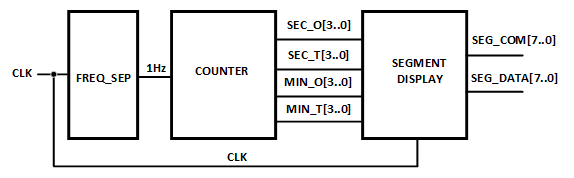
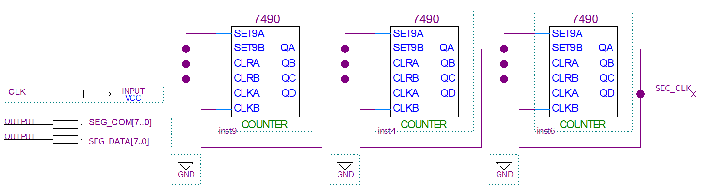
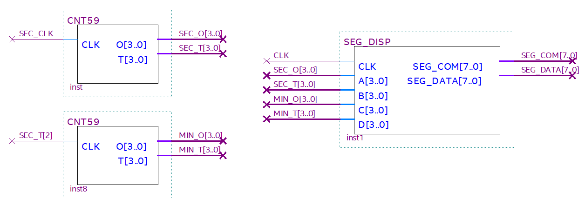

# WATCH 3
---

## 분/초가 표싣죄는 시계 Design

앞에서 실습한 COUNTER와 SEGMENT DISPLAY 회로를 이용해 시계를 만들어 보자. 

 

 

장비에서 동작시키기 위해서 좀 더 빠르게 변화할 수 있는 분과 초가 표시되는 시계를 만들어 보자.

시계의 설계는 아래 그림과 같이 COUNTER 블록과 SEGMENT DISPLAY블록으로 나누어 설계된다. 

  

 

SACT 장비에서 확인하기 위하여 연결된 장치와 장비에 연결된 핀 번호는 다음과 같다. 

|PORT NAME|CLK|
|:-:|:-:|
|HARDWARE|Main Clock|
|PIN NUMBER|G2|

|PORT NAME|SEG_COM[7]|SEG_COM[6]|SEG_COM[5]|SEG_COM[4]|
|:-:|:-:|:-:|:-:|:-:|
|HARDWARE|SEG_COM[7]|SEG_COM[6]|SEG_COM[5]|SEG_COM[4]|
|PIN NUMBER|U1|T5|T4|T3|

|PORT NAME|SEG_COM[3]|SEG_COM[2]|SEG_COM[1]|SEG_COM[0]|
|:-:|:-:|:-:|:-:|:-:|
|HARDWARE|SEG_COM[3]|SEG_COM[2]|SEG_COM[1]|SEG_COM[0]|
|PIN NUMBER|R5|R4|R3|R2|

|PORT NAME|SEG_DATA[7]|SEG_DATA[6]|SEG_DATA[5]|SEG_DATA[4]|
|:-:|:-:|:-:|:-:|:-:|
|HARDWARE|SEG_A|SEG_B|SEG_C|SEG_D|
|PIN NUMBER|R1|P5|P4|R3|

|PORT NAME|SEG_DATA[3]|SEG_DATA[2]|SEG_DATA[1]|SEG_DATA[0]|
|:-:|:-:|:-:|:-:|:-:|
|HARDWARE|SEG_E|SEG_F|SEG_G|SEG_DP|
|PIN NUMBER|P2|P1|N6|N5|

 

  

### **Design**

1. 실험을 위해 Quartus의 File > New Project Wizard 메뉴를 선택하여 새 프로젝트 생성한다. 

2. Directory, Name, Top-Level Entry 창을 다음과 같이 설정한다. 

    |Working Directory|d:\work\WATCH|
    |-|-|
    |project Name | WATCH|
    |Top Level Entry Name | WATCH|

3. Project Type을 Empty project로 설정하고, Add File 창은 별다른 설정을 하지 않는다. 

4. Family, Device & Board Setting 창에서 먼저 아래와 같이 Device Family/Package /Pin Count/Core speed grade를 설정하고, Name를 설정한다. 

    |Device Family|Cyclone 10 LP|
    |-|:-:|
    |Package|FBGA|
    |Pin count|484|
    |Core Speed grade|8|
    |Available devices|10CL080YF484C8G|

      

>디바이스의 Name이 달라지면, Programming이 되지 않기 때문에 주의해야 한다. 

5. EDA Tool Settings도 별다른 설정을 하지 않는다. 

    Summary를 확인해 지금 설정된 내용을 확인한 후, Finish를 눌러 프로젝트 생성을 마친다. 

6. 이전에 만들었던 CNT59와 SEG_DISP 프로젝트 directory에서 사용한 SEG_DISP.bdf, CNT59.bdf 파일을 현재의 프로젝트 작업 directory인 WATCH에 복사한다. 

>  위의 복사한 파일들이 별도로 만든 회로이기 때문에, 프로젝트 폴더에 포함시켜주어야 한다. 이렇게 하지 않으면 Compile시 파일이 없다는 오류 메시지가 출력된다. 
 

7. CNT59.bdf와 SEG_DISP.bdf 파일을 File > Open 메뉴를 통해서 불러온 후, File > Create / Update > Create Symbol Files for Current File 메뉴를 선택하여, 현재 불러온 논리 회로에 대한 심볼 파일을 생성한다 

8. File > New 메뉴를 눌러서 New 창을 불러온 후, Block Diagram/Schematic File을 선택한다.

9. 도면에서 마우스의 오른쪽 버튼을 눌러 Insert > Symbol 메뉴를 선택(도면을 마우스로 더블 클릭 해도 됨.)하여, 심볼을 추가하여 다음 그림과 같이 논리 회로를 완성시킨다. 

      
      

    - 위의 회로에서 7490 3개를 사용한 회로를 설명하겠다. 

        앞의 COUNTER 프로젝트에서 작업한 7490을 사용한 10진 카운터를 3개 연결한 회로이다. 

        CLK의 입력을 받아 7490 회로를 통과하면 10번 카운트할 하고, 그 결과를 옆의 7490 회로의 클럭 입력으로 전달된다. 

        즉, 1개의 7490 회로를 통과하면 입력된 클럭의 1/10으로 감소된 클럭이 전달되는 것이다. 

        3개의 7490 회로가 사용되었기 때문에 1/1000으로 감소한 클럭이 출력된다. 

        1kHz의 CLOCK 입력을 받아 1Hz의 클럭(SEC_CLK)을 만드는 블록이다. 

    - CNT59 블록을 2개 사용하여 0-59의 초와 0-59의 분을 카운트하는 블록을 구성되었다. 

    - SEG_DISP 블록은 앞의 CNT59의 초와 분을 카운트하는 블록의 데이터를 받아 장비의 7-Segment Array에 Display하는 블록을 구성하였다. 

        여기에서의 클럭 입력은 입력받은 CLK이다. 그 이유는 7-Segment Array에 문자를 표시하기 위해서는 더 빠른 클럭이 필요하기 때문이다. 

 

10. Save 한다. 이 때, 파일명을 Project 명(기본 설정)으로 설정한다. 

### **Compile**

11. Processing > Start Compilation 메뉴를 선택하여, Compile을 진행한다. 

    설계된 부분의 오류가 있는지를 검사하고, 합성 / 타이밍 정보 생성 / 프로그래밍 파일 생성 을 하는 과정이다. 

### Device & Pin Assignment

12. 장비를 통해서 하드웨어의 동작을 확인해 보아야 한다. 

    장비를 확인하기 위해서, 입출력 포트에 대한 핀을 설정해 주어야 한다. 
 

13. 먼저 Assignment > Device 항목을 선택한다. 

    나타난 Device 설정 창에서 Device and Pin Options 버튼을 누른다. 
   
14. Device & Pin Option 창에서 Unused Pins 카테고리를 선택하고, Reserve all unused pins를 As output driving ground로 설정한다. 

    이렇게 하는 이유는 기본 설정 값이 As input tri-stated with weak pull-up 인데, 이렇게 할 때 설정하지 않은 핀들이 약간의 pull-up 상태 즉 High의 상태가 된다. 

    장비에 구성된 LED등의 요소가 많기 때문에, As output driving ground로 설정하지 않으면 설정하지 않은 LED에 ON되어 출력된 결과에 혼동이 올 수 있다. 그래서 왠만하면 Unused Pin을 As output driving ground로 설정 해 주는 것이 좋다. 

      
 

15. Assignment > Pin Planner 메뉴를 선택하여 핀 번호를 설정한다. 

16. 핀 번호는 Location 부분에 아래 표와 같이 핀 번호를 설정해 주면 된다. 

    핀 번호를 다르게 설정하면, 장비에서 동작을 확인하기 어렵기 때문에 핀 번호를 일치시켜 줘야 한다. 

|PORT NAME|CLK|
|:-:|:-:|
|HARDWARE|Main Clock|
|PIN NUMBER|G2|

|PORT NAME|SEG_COM[7]|SEG_COM[6]|SEG_COM[5]|SEG_COM[4]|
|:-:|:-:|:-:|:-:|:-:|
|HARDWARE|SEG_COM[7]|SEG_COM[6]|SEG_COM[5]|SEG_COM[4]|
|PIN NUMBER|U1|T5|T4|T3|

|PORT NAME|SEG_COM[3]|SEG_COM[2]|SEG_COM[1]|SEG_COM[0]|
|:-:|:-:|:-:|:-:|:-:|
|HARDWARE|SEG_COM[3]|SEG_COM[2]|SEG_COM[1]|SEG_COM[0]|
|PIN NUMBER|R5|R4|R3|R2|

|PORT NAME|SEG_DATA[7]|SEG_DATA[6]|SEG_DATA[5]|SEG_DATA[4]|
|:-:|:-:|:-:|:-:|:-:|
|HARDWARE|SEG_A|SEG_B|SEG_C|SEG_D|
|PIN NUMBER|R1|P5|P4|R3|

|PORT NAME|SEG_DATA[3]|SEG_DATA[2]|SEG_DATA[1]|SEG_DATA[0]|
|:-:|:-:|:-:|:-:|:-:|
|HARDWARE|SEG_E|SEG_F|SEG_G|SEG_DP|
|PIN NUMBER|P2|P1|N6|N5|

 

 

17. 핀 설정 후 창을 닫고, Processing > Start Compilation 메뉴를 선택하여 Compile을 진행한다. 

    이것은 최종적으로 설정한 Device 옵션과 핀 설정 정보를 포함한 프로그래밍 파일을 만들기 위한 것이다. 
  
    
### **Check Hardware Operation**

18. SACT 장비를 준비한다. USB 케이블과 파워 케이블을 연결하고, 전원 스위치를 눌러 장비에 전원을 인가시킨다. 

19. Quartus 소프트웨어에서 Tool > Programmer 메뉴를 선택한다.

20. Programmer창의 Hardware Setup이 USB Blaster가 연결되어 있는지 확인하고, Start 버튼을 눌러 프로그래밍 하고 장비에서 동작을 확인한다. 

 

21. CLOCK 블록의  CLOCK SELECT SWITCH를 이용하여 1kHz로 설정하고, 

    CLOCK을 변화시켜갘며 회로의 동작을 확인해 보자.

 

 

## 응용 Design

22. 시 / 분 / 초가 표시되는 디지털 시계를 설계해 보자.

