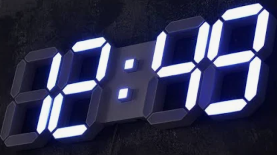
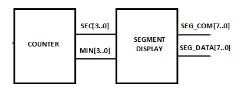
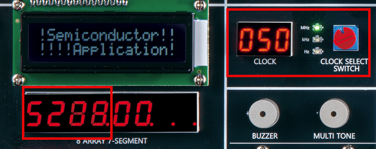

# WATCH
---

## Planning

Let's design a digital clock/watch that displays minute and second. 

Clock/Watch usually displays hour and minute as shown below.
 

 

 

Let's create a clock that displays minute and second to operate faster on equipment. 

Clock design is divided into COUNTER block and SEGMENT DISPLAY block as shown below.
 

  

COUNTER block receives CLOCK of 1 second cycle and count seconds and minutes.

SEGMENT DISPLAY block receives BCD value of second and minute that COUNTER block outputs and displays them on 7-SEGMENT ARRAY.

  

Devices used in the equipment are as below.

|PORT NAME|CLK|
|:-:|:-:|
|HARDWARE|Main Clock|

|PORT NAME|SEG_COM[7]|SEG_COM[6]|SEG_COM[5]|SEG_COM[4]|
|:-:|:-:|:-:|:-:|:-:|
|HARDWARE|SEG_COM[7]|SEG_COM[6]|SEG_COM[5]|SEG_COM[4]|

|PORT NAME|SEG_COM[3]|SEG_COM[2]|SEG_COM[1]|SEG_COM[0]|
|:-:|:-:|:-:|:-:|:-:|
|HARDWARE|SEG_COM[3]|SEG_COM[2]|SEG_COM[1]|SEG_COM[0]|

|PORT NAME|SEG_DATA[7]|SEG_DATA[6]|SEG_DATA[5]|SEG_DATA[4]|
|:-:|:-:|:-:|:-:|:-:|
|HARDWARE|SEG_A|SEG_B|SEG_C|SEG_D|

|PORT NAME|SEG_DATA[3]|SEG_DATA[2]|SEG_DATA[1]|SEG_DATA[0]|
|:-:|:-:|:-:|:-:|:-:|
|HARDWARE|SEG_E|SEG_F|SEG_G|SEG_DP|

  

  

## [10-1. MOD 60 Counter](./10-1.COUNTER.md)

## [10-2. Segment Array Display Controller](./10-2.SEG_DISPLAY.md)

## [10-3. Watch (Miniute / Second )](./10-3.WATCH_.md)

