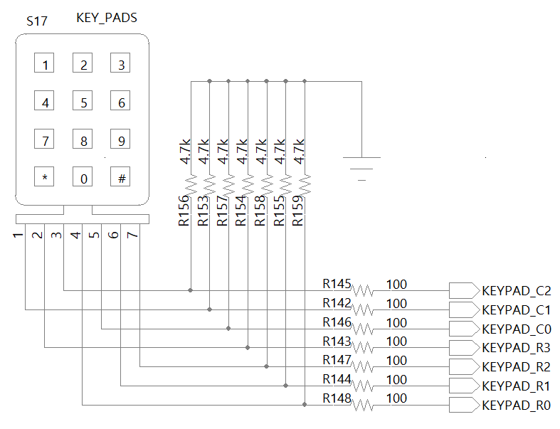
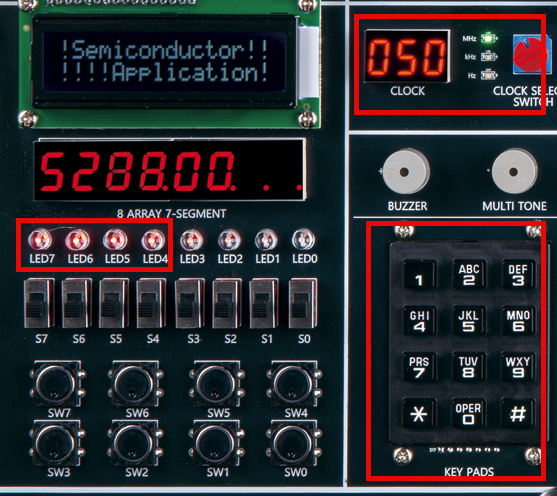
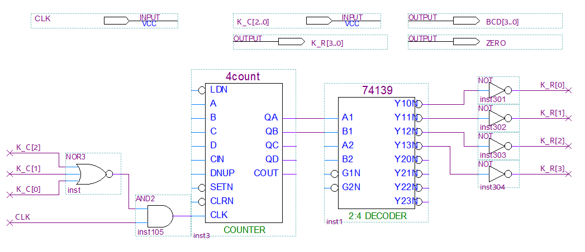
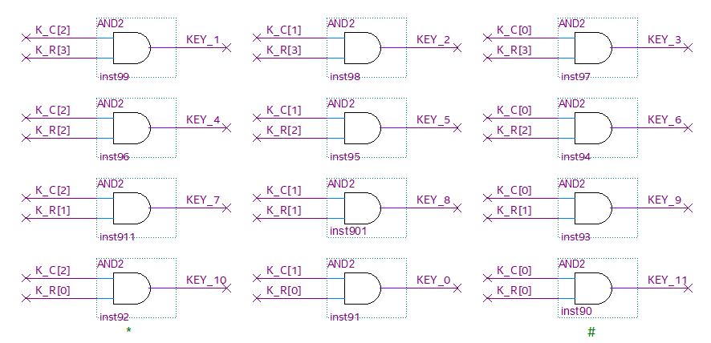
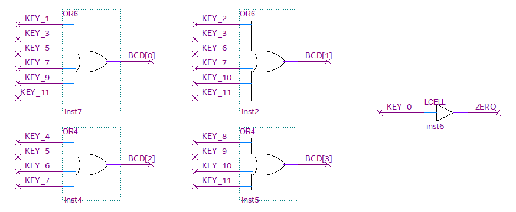

# Secret Code(DoorLock) 1
---

## KEY PADS 제어기 Design

디지털 도어락에서는 0-9, 그리고 *와 #의 총 12개의 입력이 있는 KEYPADS를 사용한다. 

장비에도 이 키패드가 구성되어 있다. 

7-SEGMENT Array에서 설명한 것과 비슷한 내용인데, 0-9, #, *의 12개의 버튼을 사용하기 위해서는 12개의 데이터 라인이 필요한데, 3 x 4 형태로 구성하여 7개의 데이터 라인으로 12개의 입력을 받을 수 있도록 구성하여 사용한다. 

물론 이렇게 사용하기 위해서는 전용 KEYPADS 드라이버의 설계가 링요하다. 

이 절에서는 이 KEYPADS 제어 회로를 설명한다. 

  

회로에서 보는 것과 같이 3x4의 Keypad의 12개의 버튼을 입력 받아 사용할 수 있는 장치를 사용하고 있다. 여기에는 모두 풀-다운 저항을 사용하고 있어서 모든 데이터 라인에 기본적으로 ‘0’의 값을 가지고 있습니다.

 

4비트 KEYPAD_R[3..0]에 [1 0 0 0]. [0 1 0 0], [0 0 1 0], [0 0 0 1]의 데이터를 전달하고, 그 때의 KEYPAD_C[2..0]에 어떤 데이터가 들어왔는지를 검출해 어떤 키가 눌렸는지를 확인할 수 있다. 

다음 표는 KEYPAD 제어에 대한 데이터이다. 

|KEYPADS|BCD[3..0]||KEYPAD_R[3..0]|KEYPAD_C[2..0]|
|:-:|:-:|:-:|:-:|:-:|
|1| 0 0 0 1 || 1 0 0 0 | 1 0 0 |
|2| 0 0 1 0 || 1 0 0 0 | 0 1 0 |
|3| 0 0 1 1 || 1 0 0 0 | 0 0 1 |
|4| 0 1 0 0 || 0 1 0 0 | 1 0 0 |
|5| 0 1 0 1 || 0 1 0 0 | 0 1 0 |
|6| 0 1 1 0 || 0 1 0 0 | 0 0 1 |
|7| 0 1 1 1 || 0 0 1 0 | 1 0 0 |
|8| 1 0 0 0 || 0 0 1 0 | 0 1 0 |
|9| 1 0 0 1 || 0 0 1 0 | 0 0 1 |
|*| 1 0 1 0 || 0 0 0 1 | 1 0 0 |
|0| 0 0 0 0 || 0 0 0 1 | 0 1 0 |
|#| 1 0 1 1 || 0 0 0 1 | 0 0 1 |

*와 # 문자에 대해서는 BCD 값이 없지만, 동작을 확인하기 위해서 각각 [ 1 0 1 0 ]과 [ 1 0 1 1]로 설정하여 동작시킨다. 

SACT 장비에서 확인하기 위하여 연결된 장치와 장비에 연결된 핀 번호는 다음과 같다. 

|PORT NAME|CLK|
|:-:|:-:|
|HARDWARE|Main Clock|
|PIN NUMBER|G2|

|PORT NAME|K_R[3]|K_R[2]|K_R[1]|K_R[0]|
|:-:|:-:|:-:|:-:|:-:|
|HARDWARE|KEYPAD_R[3]|KEYPAD_R[2]|KEYPAD_R[1]|KEYPAD_R[0]|
|PIN NUMBER|AB10|AA10|V11|U11|

|PORT NAME|K_C[2]|K_C[1]|K_C[0]|
|:-:|:-:|:-:|:-:|
|HARDWARE|KEYPAD_C[2]|KEYPAD_C[1]|KEYPAD_C[0]|
|PIN NUMBER|U10|Y10|W10|

|PORT NAME|BCD[3]|BCD[2]|BCD[1]|BCD[0]|ZERO|
|:-:|:-:|:-:|:-:|:-:|:-:|
|HARDWARE|LED7|LED6|LED5|LED4|LED5|
|PIN NUMBER|W2|Y1|Y2|Y3|AA3|

 

  

### **Design**

1. 실험을 위해 Quartus의 File > New Project Wizard 메뉴를 선택하여 새 프로젝트 생성한다. 

2. Directory, Name, Top-Level Entry 창을 다음과 같이 설정한다. 

    |Working Directory|d:\work\KEYPADS|
    |-|-|
    |project Name | KEYPADS|
    |Top Level Entry Name | KEYPADS|

3. Project Type을 Empty project로 설정하고, Add File 창은 별다른 설정을 하지 않는다. 

4. Family, Device & Board Setting 창에서 먼저 아래와 같이 Device Family/Package /Pin Count/Core speed grade를 설정하고, Name를 설정한다. 

    |Device Family|Cyclone 10 LP|
    |-|:-:|
    |Package|FBGA|
    |Pin count|484|
    |Core Speed grade|8|
    |Available devices|10CL080YF484C8G|

      

>디바이스의 Name이 달라지면, Programming이 되지 않기 때문에 주의해야 한다. 

5. EDA Tool Settings도 별다른 설정을 하지 않는다. 

    Summary를 확인해 지금 설정된 내용을 확인한 후, Finish를 눌러 프로젝트 생성을 마친다. 

6. File > New 메뉴를 눌러서 New 창을 불러온 후, Block Diagram/Schematic File을 선택한다.

7. 도면에서 마우스의 오른쪽 버튼을 눌러 Insert > Symbol 메뉴를 선택(도면을 마우스로 더블 클릭 해도 됨.)하여 input 심볼과 output 심볼, 7490 심볼을 불러와서, 도면에 배치한다. 

8. 다음 그림과 같이 input과 output의 이름을 수정하고, 심볼을 더 추가해 심볼 사이를 wire로 연결하여 도면을 완성시킨다. 

      

    - 위의 회로는 KEYPAD에 KEYPAD_R의 값을 출력하고, 눌린 키에 대응하는 KEYPAD_C의 값을 받기 위한 블록이다. 

    - 4COUNT는 4비트 카운터인데, 이 중 2비트만 사용하여 2비트 카운터로 동작하도록 한다. 

    - 74139은 2x4 DECODER이다.  즉, 아래 표와 같이 K_R에 값을 전달하기 위한 것이다. 

        |NO.|K_R[3..0]|
        |:-:|:-:|
        |1| 1 0 0 0 |
        |2| 0 1 0 0 |
        |3| 0 0 1 0 |
        |4| 0 0 0 1 |
        |5| 1 0 0 0 |
    
    - 4COUNT 회로의 CLK입력에 K_C의 값과 CLK의 값을 조합논리로 구성된 회로가 설계되어 있는데, 이것은 K_C의 입력 즉 KEYPADS에 입력이 있을 경우, 카운트를 멈추어 K_R에 전달하는 값을 고정하기 위한 것이다. 

    이렇게 하지 않으면 뒤에 비교기에서, BCD입력의 데이터가 계속 변화되어 버튼을 연속적으로 누르고 있는 것처럼 동작한다. 
     

      

    - 위의 회로는 출력된 K_R의 값과 입력된 K_C의 값을 비교하여 현재 눌린 버튼에 대한 데이터를 찾는 부분이다. 

    다음 표와 같은 구성을 확인할 수 있다. 

    |KEYPADS|K_R[3..0]|K_C[2..0]| 수식 |
    |:-:|:-:|:-:|:-:|
    |KEY_1| 1 0 0 0 | 1 0 0 | K_R3 & K_C2 | 
    |KEY_2| 1 0 0 0 | 0 1 0 | K_R3 & K_C1 |
    |KEY_3| 1 0 0 0 | 0 0 1 | K_R3 & K_C0 |
    |KEY_4| 0 1 0 0 | 1 0 0 | K_R2 & K_C2 |
    |KEY_5| 0 1 0 0 | 0 1 0 | K_R2 & K_C1 |
    |KEY_6| 0 1 0 0 | 0 0 1 | K_R2 & K_C0 |
    |KEY_7| 0 0 1 0 | 1 0 0 | K_R1 & K_C2 |
    |KEY_8| 0 0 1 0 | 0 1 0 | K_R1 & K_C1 |
    |KEY_9| 0 0 1 0 | 0 0 1 | K_R1 & K_C0 |
    |KEY_10(*)| 0 0 0 1 | 1 0 0 | K_R0 & K_C2 |
    |KEY_0| 0 0 0 1 | 0 1 0 | K_R0 & K_C1 |
    |KEY_11(#)| 0 0 0 1 | 0 0 1 | K_R0 & K_C0 |

 

  

- 위 회로는 위에서 인식된 KEY의 값을 회로에서 꾸미기 좋도록 BCD 데이터로 변환하는 회로이다. 

    BCD[3], BCD[2], BCD[1], BCD[0]의 데이터를 기준으로 아래와 같은 식으로 구성할 수 있다. 

   |BCD[3..0] 수식|
   |:-|
   |BCD[0] = KEY_1 + KEY_3 + KEY_5 + KEY_7 + KEY_9 + KEY_11(#)|
   |BCD[1] = KEY_2 + KEY_3 + KEY_6 + KEY_7 + KEY_10(*) + KEY_11(#)|
   |BCD[2] = KEY_4 + KEY_5 + KEY_6 + KEY_7 |
   |BCD[3] = KEY_8 + KEY_9 + + KEY_10(*) + KEY_11(#)|

   KEY_0가 BCD 값으로 0000이기 때문에, ZERO라는 포트를 추가하여 0번 키에 반응하도록 하였다. 

     
    
9. Save 한다. 이 때, 파일명을 Project 명(기본 설정)으로 설정한다. 

### **Compile**

10. Processing > Start Compilation 메뉴를 선택하여, Compile을 진행한다. 

    설계된 부분의 오류가 있는지를 검사하고, 합성 / 타이밍 정보 생성 / 프로그래밍 파일 생성 을 하는 과정이다. 

### Device & Pin Assignment

11. 장비를 통해서 하드웨어의 동작을 확인해 보아야 한다. 

    장비를 확인하기 위해서, 입출력 포트에 대한 핀을 설정해 주어야 한다. 
 

12. 먼저 Assignment > Device 항목을 선택한다. 

    나타난 Device 설정 창에서 Device and Pin Options 버튼을 누른다. 
   
13. Device & Pin Option 창에서 Unused Pins 카테고리를 선택하고, Reserve all unused pins를 As output driving ground로 설정한다. 

    이렇게 하는 이유는 기본 설정 값이 As input tri-stated with weak pull-up 인데, 이렇게 할 때 설정하지 않은 핀들이 약간의 pull-up 상태 즉 High의 상태가 된다. 

    장비에 구성된 LED등의 요소가 많기 때문에, As output driving ground로 설정하지 않으면 설정하지 않은 LED에 ON되어 출력된 결과에 혼동이 올 수 있다. 그래서 왠만하면 Unused Pin을 As output driving ground로 설정 해 주는 것이 좋다. 

      
 

14. Assignment > Pin Planner 메뉴를 선택하여 핀 번호를 설정한다. 

15. 핀 번호는 Location 부분에 아래 표와 같이 핀 번호를 설정해 주면 된다. 

    핀 번호를 다르게 설정하면, 장비에서 동작을 확인하기 어렵기 때문에 핀 번호를 일치시켜 줘야 한다. 

|PORT NAME|CLK|
|:-:|:-:|
|HARDWARE|Main Clock|
|PIN NUMBER|G2|

|PORT NAME|K_R[3]|K_R[2]|K_R[1]|K_R[0]|
|:-:|:-:|:-:|:-:|:-:|
|HARDWARE|KEYPAD_R[3]|KEYPAD_R[2]|KEYPAD_R[1]|KEYPAD_R[0]|
|PIN NUMBER|AB10|AA10|V11|U11|

|PORT NAME|K_C[2]|K_C[1]|K_C[0]|
|:-:|:-:|:-:|:-:|
|HARDWARE|KEYPAD_C[2]|KEYPAD_C[1]|KEYPAD_C[0]|
|PIN NUMBER|U10|Y10|W10|

|PORT NAME|BCD[3]|BCD[2]|BCD[1]|BCD[0]|ZERO|
|:-:|:-:|:-:|:-:|:-:|:-:|
|HARDWARE|LED7|LED6|LED5|LED4|LED5|
|PIN NUMBER|W2|Y1|Y2|Y3|AA3|

 

 
 

16. 핀 설정 후 창을 닫고, Processing > Start Compilation 메뉴를 선택하여 Compile을 진행한다. 

    이것은 최종적으로 설정한 Device 옵션과 핀 설정 정보를 포함한 프로그래밍 파일을 만들기 위한 것이다. 
  
    
### **Check Hardware Operation**

17. SACT 장비를 준비한다. USB 케이블과 파워 케이블을 연결하고, 전원 스위치를 눌러 장비에 전원을 인가시킨다. 

18. Quartus 소프트웨어에서 Tool > Programmer 메뉴를 선택한다.

19. Programmer창의 Hardware Setup이 USB Blaster가 연결되어 있는지 확인하고, Start 버튼을 눌러 프로그래밍 하고 장비에서 동작을 확인한다. 

 

20. CLOCK 블록의  CLOCK SELECT SWITCH를 이용하여 1kHz로 설정하고, KEYPADS 버튼을 눌러 누른 키에 해당하는 BCD값이 LED에 출력되는지 확인해 보자. 

|PORT NAME|CLK|
|:-:|:-:|
|HARDWARE|Main Clock|

|PORT NAME|K_R[3]|K_R[2]|K_R[1]|K_R[0]|
|:-:|:-:|:-:|:-:|:-:|
|HARDWARE|KEYPAD_R[3]|KEYPAD_R[2]|KEYPAD_R[1]|KEYPAD_R[0]|

|PORT NAME|K_C[2]|K_C[1]|K_C[0]|
|:-:|:-:|:-:|:-:|
|HARDWARE|KEYPAD_C[2]|KEYPAD_C[1]|KEYPAD_C[0]|

|PORT NAME|BCD[3]|BCD[2]|BCD[1]|BCD[0]|ZERO|
|:-:|:-:|:-:|:-:|:-:|:-:|
|HARDWARE|LED7|LED6|LED5|LED4|LED5|

 

