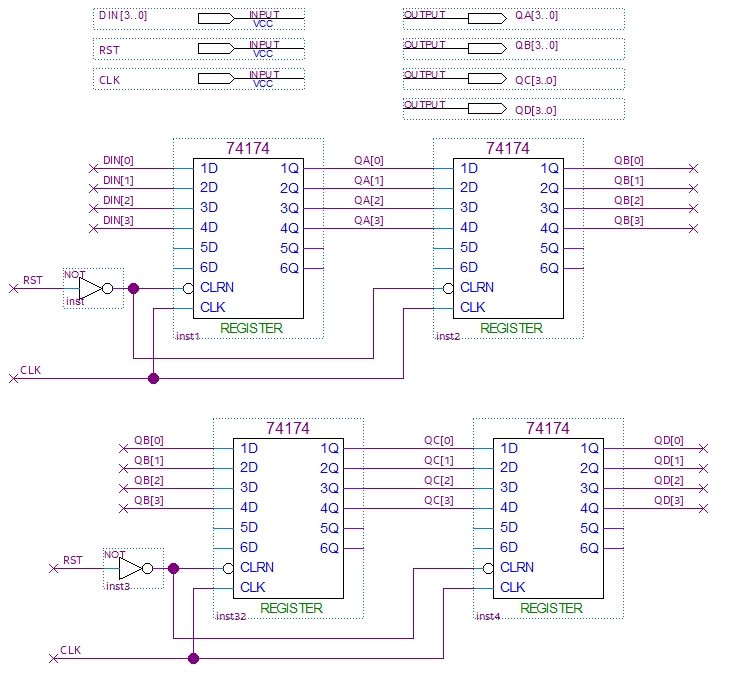
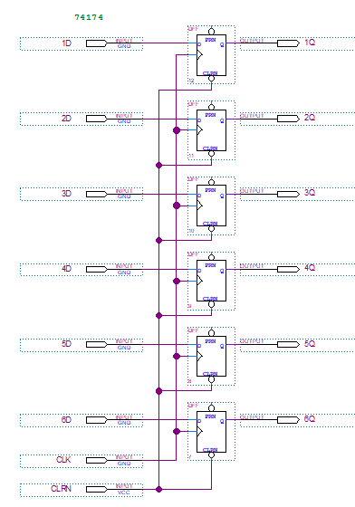
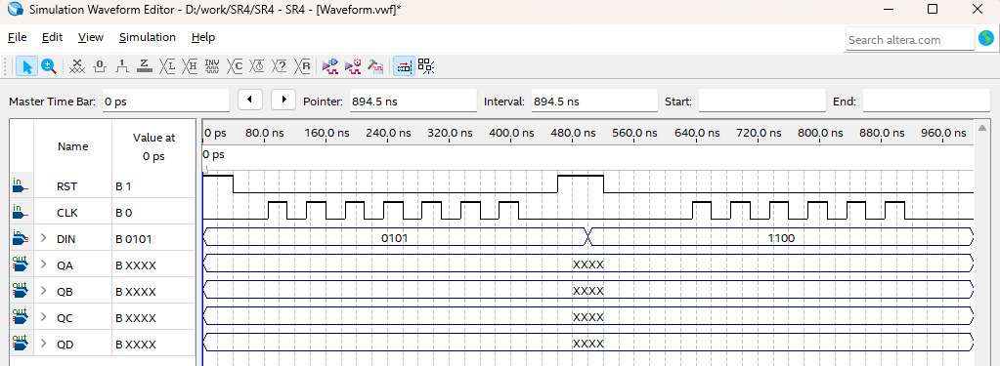
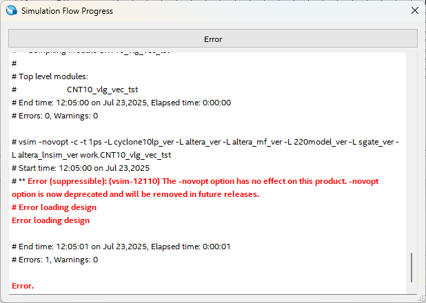
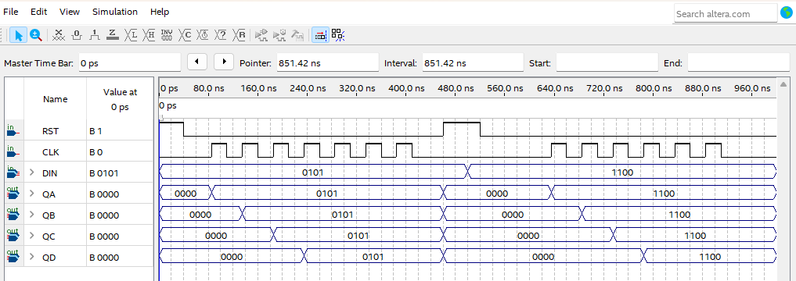
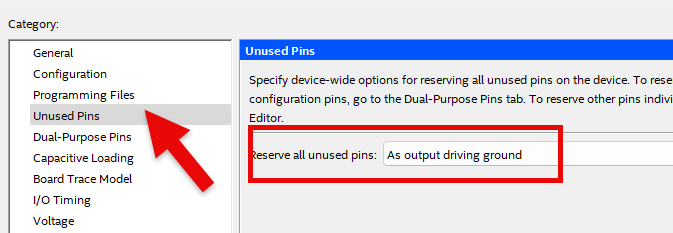

# Secret Code(DoorLock) 2
---

## 4비트 시프트 레지스터 

지금 설계하는 Door Lock의 비밀번호는 4자리 코드로 구성하도록 합니다. 

다시 말해 4비트 데이터의 4개 시프트 레지스터를 구성해야 한다. 

 
앞의 챕터에서 아래 그림과 같은 SISO 구조를 실습했었다. 

 
  

이 SISO는 1비트의 4개의 Register를 구성하는데, 이 절의 회로에서는 이 SISO가 4개로 구성된 회로를 설계한다. 

 

|Clock ||DIN[3..0]|QA[3..0]|QB[3..0]|QC[3..0]|QD[3..0]|
|:-:|:-:|:-:|:-:|:-:|:-:|:-:|
|0|| DATA1 | 0 | 0 | 0 | 0 | 
|1|| DATA2 | DATA1 | 0 | 0 | 0 | 
|2|| DATA3 | DATA2 | DATA1 | 0 | 0 | 
|3|| DATA4 | DATA3 | DATA2 | DATA1 | 0 | 
|4|| - | DATA4 | DATA3 | DATA2 | DATA1 | 

CLOCK의 입력이 있을 때, DATA가 각각 QA -> QB -> QC -> QD로 전달된다. 

이것은 KEYPAD를 4번 눌러 4자리의 숫자를 설정하는 것을 의미한다. 

 

SACT 장비에서 확인하기 위하여 연결된 장치와 장비에 연결된 핀 번호는 다음과 같다. 

4비트 4개의 시프트 레지스터를 확인하기 위해서는 16개의 LED가 필요한데, 장비에서는 8개의 LED만 있기 때문에, 신호등의 차도 4방향 4개의 LED를 통해 확인한다. 

|PORT NAME|CLK|RST|
|:-:|:-:|:-:|
|HARDWARE|SW7|SW6|
|PIN NUMBER|W8|AB8|

|PORT NAME|DIN[3]|DIN[2]|DIN[1]|DIN[0]|
|:-:|:-:|:-:|:-:|:-:|
|HARDWARE|S7|S6|S5|S4|
|PIN NUMBER|Y6|W7|AB6|AA7|

|PORT NAME|QA[3]|QA[2]|QA[1]|QA[0]|
|:-:|:-:|:-:|:-:|:-:|
|HARDWARE|N_C_G|N_C_L|N_C_Y|N_C_R|
|PIN NUMBER|W22|V22|Y21|W19|

|PORT NAME|QB[3]|QB[2]|QB[1]|QB[0]|
|:-:|:-:|:-:|:-:|:-:|
|HARDWARE|E_C_G|E_C_L|E_C_Y|E_C_R|
|PIN NUMBER|T16|V16|AB16|W17|

|PORT NAME|QC[3]|QC[2]|QC[1]|QC[0]|
|:-:|:-:|:-:|:-:|:-:|
|HARDWARE|S_C_G|S_C_L|S_C_Y|S_C_R|
|PIN NUMBER|AB18|AB19|AB20|AA22|

|PORT NAME|QD[3]|QD[2]|QD[1]|QD[0]|
|:-:|:-:|:-:|:-:|:-:|
|HARDWARE|W_C_G|W_C_L|W_C_Y|W_C_R|
|PIN NUMBER|AA18|AA19|AA20|AA21|

 

  

### **설계**

1. 실험을 위해 Quartus의 File > New Project Wizard 메뉴를 선택하여 새 프로젝트 생성한다. 

2. Directory, Name, Top-Level Entry 창을 다음과 같이 설정한다. 

    |Working Directory|d:\work\SR4|
    |-|-|
    |project Name | SR4|
    |Top Level Entry Name | SR4|

3. Project Type을 Empty project로 설정하고, Add File 창은 별다른 설정을 하지 않는다. 

4. Family, Device & Board Setting 창에서 먼저 아래와 같이 Device Family/Package /Pin Count/Core speed grade를 설정하고, Name를 설정한다. 

    |Device Family|Cyclone 10 LP|
    |-|:-:|
    |Package|FBGA|
    |Pin count|484|
    |Core Speed grade|8|
    |Available devices|10CL080YF484C8G|

      

>디바이스의 Name이 달라지면, Programming이 되지 않기 때문에 주의해야 한다. 

5. EDA Tool Settings도 별다른 설정을 하지 않는다. 

    Summary를 확인해 지금 설정된 내용을 확인한 후, Finish를 눌러 프로젝트 생성을 마친다. 

6. File > New 메뉴를 눌러서 New 창을 불러온 후, Block Diagram/Schematic File을 선택한다.

7. 도면에서 마우스의 오른쪽 버튼을 눌러 Insert > Symbol 메뉴를 선택(도면을 마우스로 더블 클릭 해도 됨.)하고, 심볼을 추가하여 다음 그림과 같이 논리 회로를 완성시킨다. 

      

    위의 회로에서 사용한 74174는 6개의 D F-F가 구성된 Register 논리 회로 소자이다. 
    
    74174 부분을 더블 클릭하여 아래 그림과 같은 내부 회로를 확인할 수 있다. 

      
    
8. Save 한다. 이 때, 파일명을 Project 명(기본 설정)으로 설정한다.

  

### **컴파일**

9. Processing > Start Compilation 메뉴를 선택하여, 컴파일을 진행한다. 

    설계된 부분의 오류가 있는지를 검사하고, 합성 / 타이밍 정보 생성 / 프로그래밍 파일 생성 을 하는 과정이다. 

  

### **시뮬레이션**

10. 컴파일이 완료되면 시뮬레이션을 진행한다. 

    File > New 메뉴를 선택하고, 나타나는 New 창에서 Verification/Debugging Files 항목의 University Program VWF 항목을 선택한다. 
    
11. Simulation Waveform Editor창에서 Edit > Insert > Insert Node or Bus 메뉴를 선택한다. 

12. Node Finder 버튼을 누르고, Node Finder 창에서 List 버튼을 누르고, Nodes Found에서 >> 버튼을 누른다. 그리고, OK 버튼을 눌러 Simulation Waveform Editor 창에 입출력 포트를 추가한다. 

13.  Simulation Waveform Editor창에서 아래 그림과 같이 입력 포트에 대한 값을 설정하고, CLK의 값을 변화시켜 동작을 확인해 보자.

 
      

14. SAVE를 한다. 파일명은 기본 상태 그대로 놓는다. 

15. 시뮬레이션을 하기 전에, Simulation > Simulation Setting 메뉴를 선택하여, 나타나는 창에서 -novopt 부분을 지운다. 

      

    >이 -novopt를 제거하지 않으면, 시뮬레이션을 진행했을 때 아래와 같은 메시지가 나타난다. 

      

16. Simulation > Run Functional Simulation 메뉴를 선택하여 시뮬레이션을 진행한다. 

     
     

  

### Device & Pin Assignment

17. 시뮬레이션을 통해 설계된 논리 회로의 동작을 예상해 보았다면, 장비를 통해서 하드웨어의 동작을 확인해 보아야 한다. 

    장비를 확인하기 위해서, 입출력 포트에 대한 핀을 설정해 주어야 한다. 
 

18. 먼저 Assignment > Device 항목을 선택한다. 

    나타난 Device 설정 창에서 Device and Pin Options 버튼을 누른다. 
   
19. Device & Pin Option 창에서 Unused Pins 카테고리를 선택하고, Reserve all unused pins를 As output driving ground로 설정한다. 

    이렇게 하는 이유는 기본 설정 값이 As input tri-stated with weak pull-up 인데, 이렇게 할 때 설정하지 않은 핀들이 약간의 pull-up 상태 즉 High의 상태가 된다. 

    장비에 구성된 LED등의 요소가 많기 때문에, As output driving ground로 설정하지 않으면 설정하지 않은 LED에 ON되어 출력된 결과에 혼동이 올 수 있다. 그래서 왠만하면 Unused Pin을 As output driving ground로 설정 해 주는 것이 좋다. 

      
 

20. Assignment > Pin Planner 메뉴를 선택하여 핀 번호를 설정한다. 

21. 핀 번호는 Location 부분에 아래 표와 같이 핀 번호를 설정해 주면 된다. 

    핀 번호를 다르게 설정하면, 장비에서 동작을 확인하기 어렵기 때문에 핀 번호를 일치시켜 줘야 한다. 

|PORT NAME|CLK|RST|
|:-:|:-:|:-:|
|HARDWARE|SW7|SW6|
|PIN NUMBER|W8|AB8|

|PORT NAME|DIN[3]|DIN[2]|DIN[1]|DIN[0]|
|:-:|:-:|:-:|:-:|:-:|
|HARDWARE|S7|S6|S5|S4|
|PIN NUMBER|Y6|W7|AB6|AA7|

|PORT NAME|QA[3]|QA[2]|QA[1]|QA[0]|
|:-:|:-:|:-:|:-:|:-:|
|HARDWARE|N_C_G|N_C_L|N_C_Y|N_C_R|
|PIN NUMBER|W22|V22|Y21|W19|

|PORT NAME|QB[3]|QB[2]|QB[1]|QB[0]|
|:-:|:-:|:-:|:-:|:-:|
|HARDWARE|E_C_G|E_C_L|E_C_Y|E_C_R|
|PIN NUMBER|T16|V16|AB16|W17|

|PORT NAME|QC[3]|QC[2]|QC[1]|QC[0]|
|:-:|:-:|:-:|:-:|:-:|
|HARDWARE|S_C_G|S_C_L|S_C_Y|S_C_R|
|PIN NUMBER|AB18|AB19|AB20|AA22|

|PORT NAME|QD[3]|QD[2]|QD[1]|QD[0]|
|:-:|:-:|:-:|:-:|:-:|
|HARDWARE|W_C_G|W_C_L|W_C_Y|W_C_R|
|PIN NUMBER|AA18|AA19|AA20|AA21|

 

 

15. 핀 설정 후 창을 닫고, Processing > Start Compilation 메뉴를 선택하여 컴파일을 진행한다. 

    이것은 최종적으로 설정한 Device 옵션과 핀 설정 정보를 포함한 프로그래밍 파일을 만들기 위한 것이다. 
  
    
### **하드웨어 동작 확인**

16. SACT 장비를 준비한다. USB 케이블과 파워 케이블을 연결하고, 전원 스위치를 눌러 장비에 전원을 인가시킨다. 

17. Quartus 소프트웨어에서 Tool > Programmer 메뉴를 선택한다.

18. Programmer창의 Hardware Setup이 USB Blaster가 연결되어 있는지 확인하고, Start 버튼을 눌러 프로그래밍 하고 장비에서 동작을 확인한다. 

19. DIN의 값을 설정하고, CLK에 대한 버튼 스위치를 눌러 데이터가 전달 되는 것을 확인해 보자. 

|PORT NAME|CLK|RST|
|:-:|:-:|:-:|
|HARDWARE|SW7|SW6|

|PORT NAME|DIN[3]|DIN[2]|DIN[1]|DIN[0]|
|:-:|:-:|:-:|:-:|:-:|
|HARDWARE|S7|S6|S5|S4|

|PORT NAME|QA[3]|QA[2]|QA[1]|QA[0]|
|:-:|:-:|:-:|:-:|:-:|
|HARDWARE|N_C_G|N_C_L|N_C_Y|N_C_R|

|PORT NAME|QB[3]|QB[2]|QB[1]|QB[0]|
|:-:|:-:|:-:|:-:|:-:|
|HARDWARE|E_C_G|E_C_L|E_C_Y|E_C_R|

|PORT NAME|QC[3]|QC[2]|QC[1]|QC[0]|
|:-:|:-:|:-:|:-:|:-:|
|HARDWARE|S_C_G|S_C_L|S_C_Y|S_C_R|

|PORT NAME|QD[3]|QD[2]|QD[1]|QD[0]|
|:-:|:-:|:-:|:-:|:-:|
|HARDWARE|W_C_G|W_C_L|W_C_Y|W_C_R|

 

