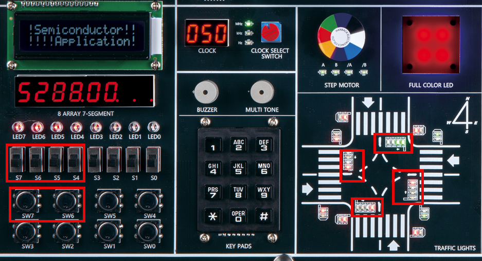

# Secret Code(DoorLock) 2
---

## 4-Bit Shift Register

Password of Door Lock to design consists of 4-digit code.

In other words, four shift registers for 4-bit data is configured.

We practiced SISO structure previously as below.

 
  

SISO consists of four 1-bit registers, and the circuit in this chapter consists of four SISOs.

 

|Clock ||DIN[3..0]|QA[3..0]|QB[3..0]|QC[3..0]|QD[3..0]|
|:-:|:-:|:-:|:-:|:-:|:-:|:-:|
|0|| DATA1 | 0 | 0 | 0 | 0 | 
|1|| DATA2 | DATA1 | 0 | 0 | 0 | 
|2|| DATA3 | DATA2 | DATA1 | 0 | 0 | 
|3|| DATA4 | DATA3 | DATA2 | DATA1 | 0 | 
|4|| - | DATA4 | DATA3 | DATA2 | DATA1 | 

When there is CLOCK input, DATA is transmitted to QA -> QB -> QC -> QD.

This means setting 4-digit number by pressing KEYPAD 4 times.

 

Devices and pin numbers connected on SACT equipment are as below.

To check four 4 bit-shift registers, 16 LEDs are required. Since there are only 8 LEDs on the equipment, check through 4 LEDs in 4 directions traffic light on the road.

|PORT NAME|CLK|RST|
|:-:|:-:|:-:|
|HARDWARE|SW7|SW6|
|PIN NUMBER|W8|AB8|

|PORT NAME|DIN[3]|DIN[2]|DIN[1]|DIN[0]|
|:-:|:-:|:-:|:-:|:-:|
|HARDWARE|S7|S6|S5|S4|
|PIN NUMBER|Y6|W7|AB6|AA7|

|PORT NAME|QA[3]|QA[2]|QA[1]|QA[0]|
|:-:|:-:|:-:|:-:|:-:|
|HARDWARE|N_C_G|N_C_L|N_C_Y|N_C_R|
|PIN NUMBER|W22|V22|Y21|W19|

|PORT NAME|QB[3]|QB[2]|QB[1]|QB[0]|
|:-:|:-:|:-:|:-:|:-:|
|HARDWARE|E_C_G|E_C_L|E_C_Y|E_C_R|
|PIN NUMBER|T16|V16|AB16|W17|

|PORT NAME|QC[3]|QC[2]|QC[1]|QC[0]|
|:-:|:-:|:-:|:-:|:-:|
|HARDWARE|S_C_G|S_C_L|S_C_Y|S_C_R|
|PIN NUMBER|AB18|AB19|AB20|AA22|

|PORT NAME|QD[3]|QD[2]|QD[1]|QD[0]|
|:-:|:-:|:-:|:-:|:-:|
|HARDWARE|W_C_G|W_C_L|W_C_Y|W_C_R|
|PIN NUMBER|AA18|AA19|AA20|AA21|

 

  

### **Design**

1. Select File > New Project Wizard in Quartus to create new project.

2. Set Directory, Name, and Top-Level Entry window as below. 

    |Working Directory|d:\work\SR4|
    |-|-|
    |project Name | SR4|
    |Top Level Entry Name | SR4|

3. Set Project Type to Empty project, and do not set Add File window.

4. In Family, Device&Board Setting window, first set Device Family/Package/Pin Count/Core speed grade as shown below, and then set Name.

    |Device Family|Cyclone 10 LP|
    |-|:-:|
    |Package|FBGA|
    |Pin count|484|
    |Core Speed grade|8|
    |Available devices|10CL080YF484C8G|

      

>Be careful that if device name changes, programming is not possible.

5. Do not set ‘EDA Tool Settings’.
Check Summary to confirm the current settings and click Finish to complete project creation.

6. Click File > New menu to open New window and select Block Diagram/Schematic File.

7. Right-click on the drawing and select Insert > Symbol menu (double-click on the drawing). Import symbol and complete the logic circuit as below.

      

    74174 used in the circuit above is a register logic circuit element consisting of 6 D FFs.
    
    You can double-click on 74174 to see the internal circuit as shown below.

      
    
8. Save. Set file name to project name (default setting).

  

### **Compile**

9. Select Processing > Start Compilation menu to proceed with compilation.
This is the process of checking for errors in the design and synthesizing/ generating timing information / generating programming file.

  

### **Simulation**

10. Once compilation is complete, start simulation.

    Select File > New and select “University Program VWF” under Verification/Debugging Files in New window that appears.
    
11. In Simulation Waveform Editor window, select Edit > Insert > Insert Node or Bus.

12. Press Node Finder button, press List button in Node Finder window, and press “>>” button in Nodes Found. Then, click OK button to add input/output port to Simulation Waveform Editor window.

13. In Simulation Waveform Editor window, set the value for input port as shown below and check the operation by changing the value of CLK.

 
      

14. SAVE. Leave the file name as default.

15. Select Simulation > Simulation Setting menu and delete “ –novopt” in the window that appears.
 

      

>If this “-novopt’ is not deleted, the following message will appear upon the simulation.

     

16. Select Simulation > Run Functional Simulation menu to run the simulation.

     
     

  

### Device & Pin Assignment

17. After predicting the operation of designed logic circuit through simulation, let’s verify the operation of the hardware through equipment.

    To check the equipment, set the pin for input/output port.
 

18. 먼저 Assignment > Device 항목을 선택한다. 

    나타난 Device 설정 창에서 Device and Pin Options 버튼을 누른다. 
   
19. In ‘Device & Pin Option’ window, select “Unused Pins” category and set “Reserve all unused pins” to “As output driving ground”.
    
    It is because that default setting is “As input tri-stated with weak pull-up”, which causes the pins not set to be slightly pulled up, in High state.
    
    Since there are many elements such as LED configured in the equipment, if ‘As output driving ground’ is not set, unset LED may become ON causing output result confusing. Therefore, it is recommended to set Unused Pin as ‘As output driving ground’.

      
 

20. Select Assignment > Pin Planner to set PIN number.

21. Set PIN number in Location as shown in the table below.
If PIN number is set differently, it will be difficult to check the operation of the device.

|PORT NAME|CLK|RST|
|:-:|:-:|:-:|
|HARDWARE|SW7|SW6|
|PIN NUMBER|W8|AB8|

|PORT NAME|DIN[3]|DIN[2]|DIN[1]|DIN[0]|
|:-:|:-:|:-:|:-:|:-:|
|HARDWARE|S7|S6|S5|S4|
|PIN NUMBER|Y6|W7|AB6|AA7|

|PORT NAME|QA[3]|QA[2]|QA[1]|QA[0]|
|:-:|:-:|:-:|:-:|:-:|
|HARDWARE|N_C_G|N_C_L|N_C_Y|N_C_R|
|PIN NUMBER|W22|V22|Y21|W19|

|PORT NAME|QB[3]|QB[2]|QB[1]|QB[0]|
|:-:|:-:|:-:|:-:|:-:|
|HARDWARE|E_C_G|E_C_L|E_C_Y|E_C_R|
|PIN NUMBER|T16|V16|AB16|W17|

|PORT NAME|QC[3]|QC[2]|QC[1]|QC[0]|
|:-:|:-:|:-:|:-:|:-:|
|HARDWARE|S_C_G|S_C_L|S_C_Y|S_C_R|
|PIN NUMBER|AB18|AB19|AB20|AA22|

|PORT NAME|QD[3]|QD[2]|QD[1]|QD[0]|
|:-:|:-:|:-:|:-:|:-:|
|HARDWARE|W_C_G|W_C_L|W_C_Y|W_C_R|
|PIN NUMBER|AA18|AA19|AA20|AA21|

 

 

22. After setting the pin, close the window and select Processing > Start Compilation menu to proceed with compilation. 

    This is to create a programming file that includes Device option and Pin configuration information.

  
    
### **Check Hardware Operation**

23. Prepare SACT equipment. Connect USB cable and power cable and press the power switch to supply power to the device.

24. In Quartus software, select Tool > Programmer.

25. Check that USB Blaster is connected in Hardware Setup on Programmer window. Press Start button to program to check the operation on the device.

26. Set the value of DIN and press the button switch for CLK to check that the data is transmitted.

|PORT NAME|CLK|RST|
|:-:|:-:|:-:|
|HARDWARE|SW7|SW6|

|PORT NAME|DIN[3]|DIN[2]|DIN[1]|DIN[0]|
|:-:|:-:|:-:|:-:|:-:|
|HARDWARE|S7|S6|S5|S4|

|PORT NAME|QA[3]|QA[2]|QA[1]|QA[0]|
|:-:|:-:|:-:|:-:|:-:|
|HARDWARE|N_C_G|N_C_L|N_C_Y|N_C_R|

|PORT NAME|QB[3]|QB[2]|QB[1]|QB[0]|
|:-:|:-:|:-:|:-:|:-:|
|HARDWARE|E_C_G|E_C_L|E_C_Y|E_C_R|

|PORT NAME|QC[3]|QC[2]|QC[1]|QC[0]|
|:-:|:-:|:-:|:-:|:-:|
|HARDWARE|S_C_G|S_C_L|S_C_Y|S_C_R|

|PORT NAME|QD[3]|QD[2]|QD[1]|QD[0]|
|:-:|:-:|:-:|:-:|:-:|
|HARDWARE|W_C_G|W_C_L|W_C_Y|W_C_R|

 

