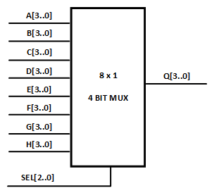
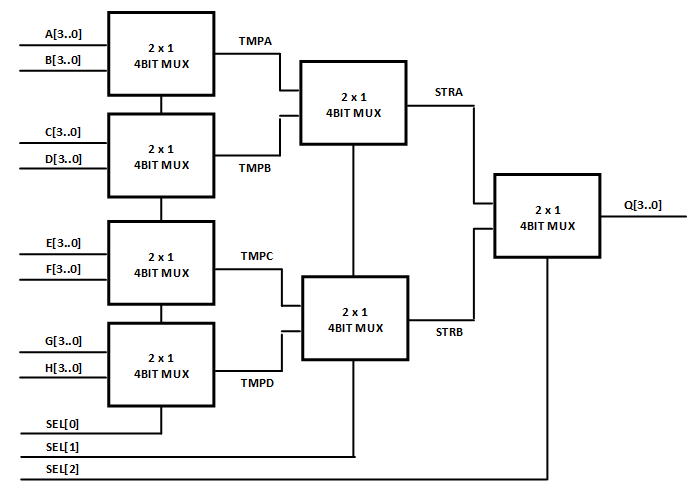
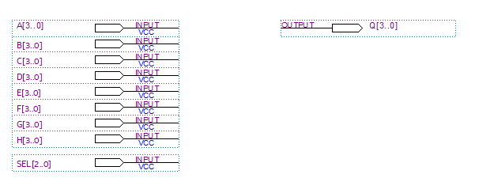
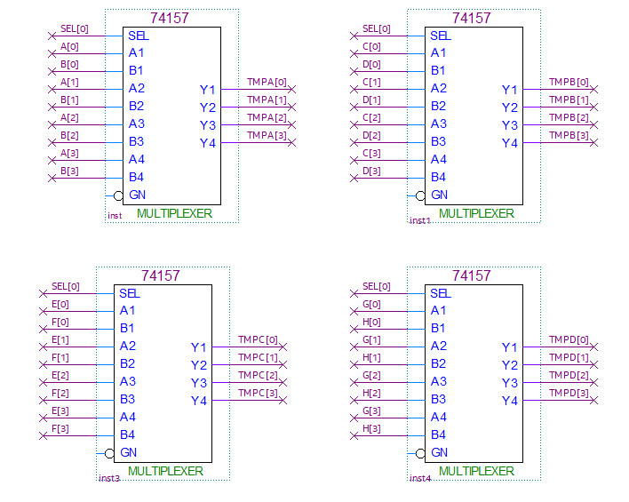
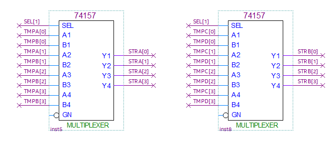
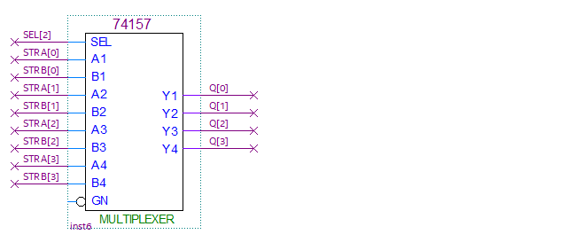
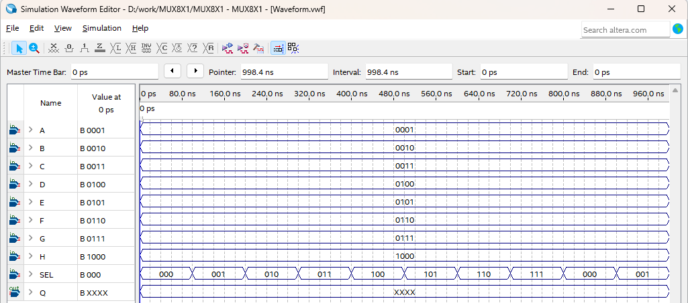
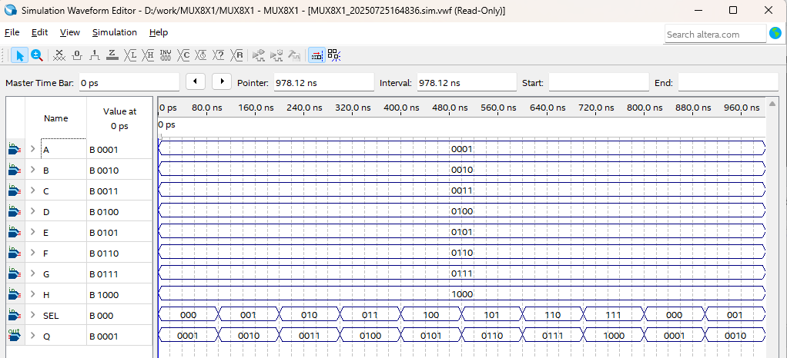

# Secret Code(DoorLock) 3
---

## 8 X 1 4비트 MUX

회로에서 7-Segment Array에 비밀 번호 4자리와 키 입력 4자리의 DISPLAY가 필요하다. 

앞의 WATCH 회로에서 SEG_DISPLAY에서는 4 x 1 4비트 MUX를 설계하여 실습했다. 

 

이 챕터에서는 8 x 1 4비트 MUX의 회로를 설계하려고 한다. 

이 회로는 아래와 같은 구조를 갖고 있다. 

 
  

그리고 다음표와 같이 SEL 신호에 의해서 입력 값이 Q로 전달된다. 
 

|SEL[2..0] | Q |
|:-:|:-:|
| 0 0 0 | A |
| 0 0 1 | B |
| 0 1 0 | C |
| 0 1 1 | D |
| 1 0 0 | E |
| 1 0 1 | F |
| 1 1 0 | G |
| 1 1 1 | H |

 

8x1 4비트 MUX 의 회로를 설계하는데, 직접 설계하면 복잡한 회로가 설계될 것이기 때문에, 이전 SEG_DISP 회로에서 사용한 74157를 사용해 다음과 같이 회로 설계한다. 

  

 

이 회로를 실험하기 위해서는 4비트 입력이 8개 필요한데, 장비 내에 32개의 입력을 줄 수 있는 방법이 없어서, 시뮬레이션으로만 결과를 확인해 보겠다. 

 

### **Design**

1. 실험을 위해 Quartus의 File > New Project Wizard 메뉴를 선택하여 새 프로젝트 생성한다. 

2. Directory, Name, Top-Level Entry 창을 다음과 같이 설정한다. 

    |Working Directory|d:\work\MUX8X1|
    |-|-|
    |project Name | MUX8X1|
    |Top Level Entry Name | MUX8X1|

3. Project Type을 Empty project로 설정하고, Add File 창은 별다른 설정을 하지 않는다. 

4. Family, Device & Board Setting 창에서 먼저 아래와 같이 Device Family/Package /Pin Count/Core speed grade를 설정하고, Name를 설정한다. 

    |Device Family|Cyclone 10 LP|
    |-|:-:|
    |Package|FBGA|
    |Pin count|484|
    |Core Speed grade|8|
    |Available devices|10CL080YF484C8G|

      

>디바이스의 Name이 달라지면, Programming이 되지 않기 때문에 주의해야 한다. 

5. EDA Tool Settings도 별다른 설정을 하지 않는다. 

    Summary를 확인해 지금 설정된 내용을 확인한 후, Finish를 눌러 프로젝트 생성을 마친다. 

6. File > New 메뉴를 눌러서 New 창을 불러온 후, Block Diagram/Schematic File을 선택한다.

7. 도면에서 마우스의 오른쪽 버튼을 눌러 Insert > Symbol 메뉴를 선택(도면을 마우스로 더블 클릭 해도 됨.)하고, 심볼을 추가하여 다음 그림과 같이 논리 회로를 완성시킨다. 

     

    - A, B, C, D, E, F, G, H의 4비트 입력 포트와 Q의 4비트 출력 포트가 설계되어 있다. 

    - 입력 포트의 선택을 위해 3비트 SEL 포트도 설계되어 있다. 
          

     

    - A와 B, C와 D, E와 F, G와 H를 SEL[0] 비트에 의해 선택되어, 각각 TMPA, TMPB, TMPC, TMPD에 출력한다. 
    
          

     

    - TMPA와 TMPB, TMPC와 TMPD를 SEL[1]에 의해 선택되어 각각 STRA와 STRB에 출력한다. 

          

     

    - STRA와 STRB가 SEL[2]에 의해 선택되어 Q 출력포트에 출력된다. 

          
    
8. Save 한다. 이 때, 파일명을 Project 명(기본 설정)으로 설정한다.

  

### **Compile**

9. Processing > Start Compilation 메뉴를 선택하여, Compile을 진행한다. 

    설계된 부분의 오류가 있는지를 검사하고, 합성 / 타이밍 정보 생성 / 프로그래밍 파일 생성 을 하는 과정이다. 

  

### **Simulation**

10. Compile이 완료되면 시뮬레이션을 진행한다. 

    File > New 메뉴를 선택하고, 나타나는 New 창에서 Verification/Debugging Files 항목의 University Program VWF 항목을 선택한다. 
    
11. Simulation Waveform Editor창에서 Edit > Insert > Insert Node or Bus 메뉴를 선택한다. 

12. Node Finder 버튼을 누르고, Node Finder 창에서 List 버튼을 누르고, Nodes Found에서 >> 버튼을 누른다. 그리고, OK 버튼을 눌러 Simulation Waveform Editor 창에 입출력 포트를 추가한다. 

13.  Simulation Waveform Editor창에서 아래 그림과 같이 입력 포트 값을 정하고, 결과를 확인해 보자. 

 
      

14. SAVE를 한다. 파일명은 기본 상태 그대로 놓는다. 

15. 시뮬레이션을 하기 전에, Simulation > Simulation Setting 메뉴를 선택하여, 나타나는 창에서 -novopt 부분을 지운다. 

      

    >이 -novopt를 제거하지 않으면, 시뮬레이션을 진행했을 때 아래와 같은 메시지가 나타난다. 

      

16. Simulation > Run Functional Simulation 메뉴를 선택하여 시뮬레이션을 진행한다. 

     
     

17. SEL의 선택에 의해 결과의 출력을 확인한다. 

  
