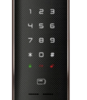
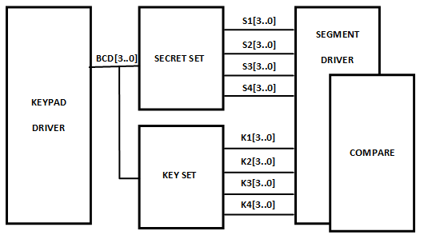
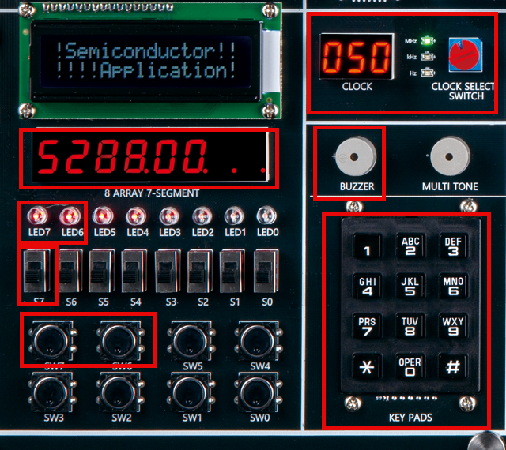
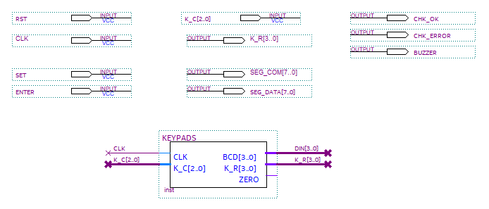
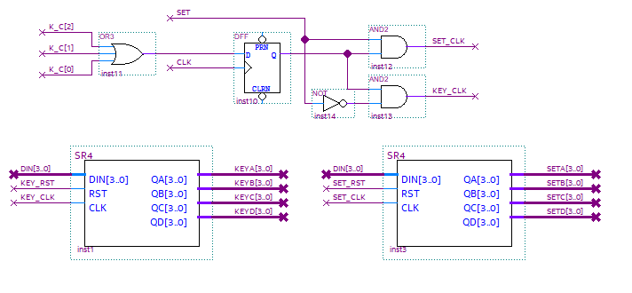
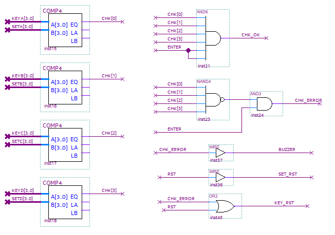
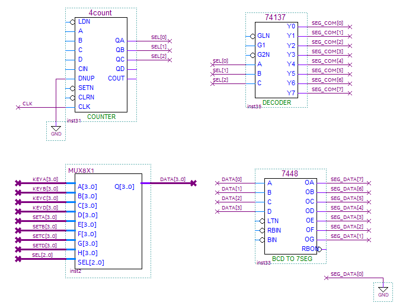

# Secret Code(DoorLock) 4
---

## Secret Code (DoorLock) Circuit Design

Let's try control DoorLock using KEYPAD control and shift register control and SEG_DISP block that practiced previously. 

 

 

The figure below shows a simple block diagram of the circuit to design.

  

The circuit performs the following operations.

- Use KEYPAD to enter number.

- Use 7-Segment Array for data output. Mark the four digits on the left as the password setting digit and the four digits on the right as the key input to match the number.

- When RESET is pressed, everything is initialized.

- When setting a password or entering a key, when KEYPAD number is pressed, SD is displayed one digit to the left.

- If SET switch value is 1, set a password. If SET switch value is 0, use as key input.

- After entering the key, when ENTER button switch is pressed, compare the password and the key input data. If they are correct, OK LED turns on, and if they are incorrect, ERROR LED turns on and BUZZER sounds. 

 

Devices and pin numbers connected on SACT equipment are as below.

|PORT NAME|CLK|
|:-:|:-:|
|HARDWARE|Main Clock|
|PIN NUMBER|G2|

|PORT NAME|K_R[3]|K_R[2]|K_R[1]|K_R[0]|
|:-:|:-:|:-:|:-:|:-:|
|HARDWARE|KEYPAD_R[3]|KEYPAD_R[2]|KEYPAD_R[1]|KEYPAD_R[0]|
|PIN NUMBER|AB10|AA10|V11|U11|

|PORT NAME|K_C[2]|K_C[1]|K_C[0]|
|:-:|:-:|:-:|:-:|
|HARDWARE|KEYPAD_C[2]|KEYPAD_C[1]|KEYPAD_C[0]|
|PIN NUMBER|U10|Y10|W10|

|PORT NAME|SET|RESET|ENTER|
|:-:|:-:|:-:|:-:|
|HARDWARE|S7|SW7|SW6|
|PIN NUMBER|Y6|W8|AB8|

|PORT NAME|CHK_OK|CHK_ERROR|BUZZER|
|:-:|:-:|:-:|:-:|
|HARDWARE|LED7|LED6|BUZZER|
|PIN NUMBER|W2|Y1|AB13|

|PORT NAME|SEG_COM[7]|SEG_COM[6]|SEG_COM[5]|SEG_COM[4]|
|:-:|:-:|:-:|:-:|:-:|
|HARDWARE|SEG_COM[7]|SEG_COM[6]|SEG_COM[5]|SEG_COM[4]|
|PIN NUMBER|U1|T5|T4|T3|

|PORT NAME|SEG_COM[3]|SEG_COM[2]|SEG_COM[1]|SEG_COM[0]|
|:-:|:-:|:-:|:-:|:-:|
|HARDWARE|SEG_COM[3]|SEG_COM[2]|SEG_COM[1]|SEG_COM[0]|
|PIN NUMBER|R5|R4|R3|R2|

|PORT NAME|SEG_DATA[7]|SEG_DATA[6]|SEG_DATA[5]|SEG_DATA[4]|
|:-:|:-:|:-:|:-:|:-:|
|HARDWARE|SEG_A|SEG_B|SEG_C|SEG_D|
|PIN NUMBER|R1|P5|P4|R3|

|PORT NAME|SEG_DATA[3]|SEG_DATA[2]|SEG_DATA[1]|SEG_DATA[0]|
|:-:|:-:|:-:|:-:|:-:|
|HARDWARE|SEG_E|SEG_F|SEG_G|SEG_DP|
|PIN NUMBER|P2|P1|N6|N5|

 

  

### **Design**

1. Select File > New Project Wizard in Quartus to create new project.

2. Set Directory, Name, and Top-Level Entry window as below. 

    |Working Directory|d:\work\DOORLOCK|
    |-|-|
    |project Name | DOORLOCK|
    |Top Level Entry Name | DOORLOCK|

3. Set Project Type to Empty project, and do not set Add File window.

4. In Family, Device&Board Setting window, first set Device Family/Package/Pin Count/Core speed grade as shown below, and then set Name.

    |Device Family|Cyclone 10 LP|
    |-|:-:|
    |Package|FBGA|
    |Pin count|484|
    |Core Speed grade|8|
    |Available devices|10CL080YF484C8G|

      

>Be careful that if device name changes, programming is not possible.

5. Do not set ‘EDA Tool Settings’.

    Check Summary to confirm the current settings and click Finish to complete project creation.

6. Copy KEYPADS.bdf, SR4.bdf, MUX8X1.bdf files used in the previously created KEYPADS, SR4, MUX8X1 project working directory to the current project working directory, DOORLOCK.
    
    Copy COMP4.bdf, COMP2.bdf, COMP2.bsf files in COMP4 project working directory used in TRAFFIC project to the current project working directory, DOORLOCK.
    
    >Copied files above are separately created circuits and they must be included in the project folder. If not, error message that there is no file when compiling will come out.

7. Import KEYPADS.bdf, SR4.bdf, MUX8X1.bdf, COMP4.bdf files through File > Open.  Select File > Create / Update > Create Symbol Files for Current File shown below and create a symbol file for the currently imported logic circuit.

8. Click File > New to open New window and select Block Diagram/Schematic File.

9. Right-click on the drawing and select Insert > Symbol menu (double-click on the drawing). Import symbol and complete the logic circuit as below.

      

    - 위의 회로는 입출력 포트를 선언한 부분과 앞에서 실습한 KEYPADS 로직을 데이터 연결한 회로이다. 

    - CLK의 입력을 받고, KEYPADS를 제어하기 위한 K_C와 K_R의 연결을 한다. 그리고, KEYPADS에서 눌린 키를 나타내는 DIN 값을 출력하는 부분이다. 

     

      

    - The circuit above connects between the declared I/O port and KEYPADS logic data previously practiced.

    - This receives CLK input and connects K_C and K_R to control KEYPADS. This is the part that outputs DIN value indicating the key pressed in KEYPADS.

    -  The circuit configured using D F-F is to convert that valuer into CLK when the value of K_C is entered (KEYPADS is pressed)
    
        There is also designed to distinguish whether this key press is for setting a password or for entering a key by SET signal.

    - In case of KEY input, it is shifted and output in the order of KEYA -> KEYB -> KEYC -> KEYD.

    - In case of password setting, it is shifted and output in the order of SETA -> SETB -> SETC -> SETD.

    
     

      

    - This is a circuit that compares KEY input and password setting value.
    
    - Compare the values of KEYA and SETA, KEYB and SETB, KEYC and SETC, KEYD and SETD. If the values are the same, HIGH signal is output to CHK[3..0].
    
    - Receive CHK signal. If all are 1 and send a signal to CHK_OK if there is ENTER input.
    
    - When there is ENTER input and any signal line is 0 among 4-bit CHK signals, send a signal to CHK_ERROR.
    
    - If there is CHK_ERROR signal (KEY value and SET value are different), BUZZER turns on.
    
    - If there is external RST input, all are initialized. If there is CHK_ERROR signal, key input value is initialized to 0.
    
     

      

  
    - This is 7-SEGMENT DISPLAY part.
    
    - In the previous WATCH example, number is displayed only on 4 SEGMENT. 
        
        In DoorLock example, password setting value and key input value must be displayed on 8 SEGMENT.
    
    - It is configured to send the corresponding data to SEG_COM and SEG_DATA with the count set to 3 bits (MOD 8) as below.
      

   |SEL[2..0] |SEG_COM[7..0]| DATA[3..0]|
   |:-:|:-:|:-:|
   |0 0 0 | 1 1 1 1 1 1 1 0| KEYA|
   |0 0 1 | 1 1 1 1 1 1 0 1| KEYB|
   |0 1 0 | 1 1 1 1 1 0 1 1| KEYC|
   |0 1 1 | 1 1 1 1 0 1 1 1| KEYD|
   |1 0 0 | 1 1 1 0 1 1 1 1| SETA|
   |1 0 1 | 1 1 0 1 1 1 1 1| SETB|
   |1 1 0 | 1 0 1 1 1 1 1 1| SETC|
   |1 1 1 | 0 1 1 1 1 1 1 1| SETD|
    

 

10. Save. Set file name to project name (default setting).

 

### **Compile**

11. Select Processing > Start Compilation menu to proceed with compilation.

    This is the process of checking for errors in the design and synthesizing/ generating timing information / generating programming file.

 

### Device & Pin Assignment

12. Verify the operation of the hardware through equipment.

    To check the equipment, set the pin for input/output port.

13. Select Assignment > Device.

    In the Device Settings window that appears, click ‘Device and Pin Options’ 

14. In ‘Device & Pin Option’ window, select “Unused Pins” category and set “Reserve all unused pins” to “As output driving ground”.
    
    It is because that default setting is “As input tri-stated with weak pull-up”, which causes the pins not set to be slightly pulled up, in High state.
    
    Since there are many elements such as LED configured in the equipment, if ‘As output driving ground’ is not set, unset LED may become ON causing output result confusing. Therefore, it is recommended to set Unused Pin as ‘As output driving ground’.

      
 

15. Select Assignment > Pin Planner to set PIN number.

16. Set PIN number in Location as shown in the table below.
If PIN number is set differently, it will be difficult to check the operation of the device.

|PORT NAME|CLK|
|:-:|:-:|
|HARDWARE|Main Clock|
|PIN NUMBER|G2|

|PORT NAME|K_R[3]|K_R[2]|K_R[1]|K_R[0]|
|:-:|:-:|:-:|:-:|:-:|
|HARDWARE|KEYPAD_R[3]|KEYPAD_R[2]|KEYPAD_R[1]|KEYPAD_R[0]|
|PIN NUMBER|AB10|AA10|V11|U11|

|PORT NAME|K_C[2]|K_C[1]|K_C[0]|
|:-:|:-:|:-:|:-:|
|HARDWARE|KEYPAD_C[2]|KEYPAD_C[1]|KEYPAD_C[0]|
|PIN NUMBER|U10|Y10|W10|

|PORT NAME|SET|RESET|ENTER|
|:-:|:-:|:-:|:-:|
|HARDWARE|S7|SW7|SW6|
|PIN NUMBER|Y6|W8|AB8|

|PORT NAME|CHK_OK|CHK_ERROR|BUZZER|
|:-:|:-:|:-:|:-:|
|HARDWARE|LED7|LED6|BUZZER|
|PIN NUMBER|W2|Y1|AB13|

|PORT NAME|SEG_COM[7]|SEG_COM[6]|SEG_COM[5]|SEG_COM[4]|
|:-:|:-:|:-:|:-:|:-:|
|HARDWARE|SEG_COM[7]|SEG_COM[6]|SEG_COM[5]|SEG_COM[4]|
|PIN NUMBER|U1|T5|T4|T3|

|PORT NAME|SEG_COM[3]|SEG_COM[2]|SEG_COM[1]|SEG_COM[0]|
|:-:|:-:|:-:|:-:|:-:|
|HARDWARE|SEG_COM[3]|SEG_COM[2]|SEG_COM[1]|SEG_COM[0]|
|PIN NUMBER|R5|R4|R3|R2|

|PORT NAME|SEG_DATA[7]|SEG_DATA[6]|SEG_DATA[5]|SEG_DATA[4]|
|:-:|:-:|:-:|:-:|:-:|
|HARDWARE|SEG_A|SEG_B|SEG_C|SEG_D|
|PIN NUMBER|R1|P5|P4|R3|

|PORT NAME|SEG_DATA[3]|SEG_DATA[2]|SEG_DATA[1]|SEG_DATA[0]|
|:-:|:-:|:-:|:-:|:-:|
|HARDWARE|SEG_E|SEG_F|SEG_G|SEG_DP|
|PIN NUMBER|P2|P1|N6|N5|

 

 
17. After setting the pin, close the window and select Processing > Start Compilation menu to proceed with compilation. 

    This is to create a programming file that includes Device option and Pin configuration information.

  
    
### **Check Hardware Operation**

18. Prepare SACT equipment. Connect USB cable and power cable and press the power switch to supply power to the device.

19. In Quartus software, select Tool > Programmer.

20. Check that USB Blaster is connected in Hardware Setup on Programmer window. Press Start button to program to check the operation on the device.

21. Set to 1Hz by turning CLOCK SELECT SWITCH in CLOCK.

    Set ‘SET’ to 1 and press KEYPADS to set 4-digit number for the password setting.

    Set ‘SET’ to 0 and press KEYPADS to set 4-digit number for key input.

    Press ENTER button to compare the password setting value with the key input value.

 

|PORT NAME|CLK|
|:-:|:-:|
|HARDWARE|Main Clock|

|PORT NAME|K_R[3]|K_R[2]|K_R[1]|K_R[0]|
|:-:|:-:|:-:|:-:|:-:|
|HARDWARE|KEYPAD_R[3]|KEYPAD_R[2]|KEYPAD_R[1]|KEYPAD_R[0]|

|PORT NAME|K_C[2]|K_C[1]|K_C[0]|
|:-:|:-:|:-:|:-:|
|HARDWARE|KEYPAD_C[2]|KEYPAD_C[1]|KEYPAD_C[0]|

|PORT NAME|SET|RESET|ENTER|
|:-:|:-:|:-:|:-:|
|HARDWARE|S7|SW7|SW6|

|PORT NAME|CHK_OK|CHK_ERROR|BUZZER|
|:-:|:-:|:-:|:-:|
|HARDWARE|LED7|LED6|BUZZER|

|PORT NAME|SEG_COM[7]|SEG_COM[6]|SEG_COM[5]|SEG_COM[4]|
|:-:|:-:|:-:|:-:|:-:|
|HARDWARE|SEG_COM[7]|SEG_COM[6]|SEG_COM[5]|SEG_COM[4]|

|PORT NAME|SEG_COM[3]|SEG_COM[2]|SEG_COM[1]|SEG_COM[0]|
|:-:|:-:|:-:|:-:|:-:|
|HARDWARE|SEG_COM[3]|SEG_COM[2]|SEG_COM[1]|SEG_COM[0]|

|PORT NAME|SEG_DATA[7]|SEG_DATA[6]|SEG_DATA[5]|SEG_DATA[4]|
|:-:|:-:|:-:|:-:|:-:|
|HARDWARE|SEG_A|SEG_B|SEG_C|SEG_D|

|PORT NAME|SEG_DATA[3]|SEG_DATA[2]|SEG_DATA[1]|SEG_DATA[0]|
|:-:|:-:|:-:|:-:|:-:|
|HARDWARE|SEG_E|SEG_F|SEG_G|SEG_DP|

 

 

## Application Design

Try to design a digital clock that displays hour, minute, second.

