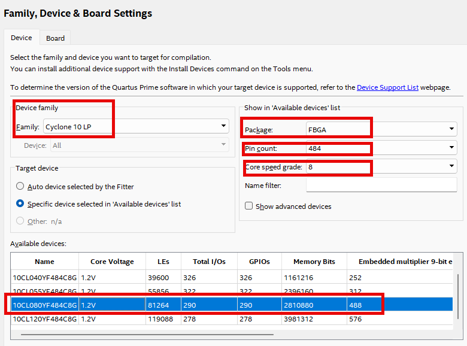

# Secret Code(DoorLock) 4
---

## Secret Code(DoorLock) 회로 Design

앞에서 실습한 KEYPAD 제어와 시프트 레지스터 제어, 그리고 이전에 실습했었던 SEG_DISP 블록을 이용하여 DoorLock 제어를 해보자. 

 

 

아래 그림은 설계할 회로를 간단하게 블록으로 나타낸 것이다. 

  

회로는 아래의 동작을 수행한다. 

- 번호의 입력은 KEYPAD를 사용한다. 

- 데이터의 출력은 7-Segment Array를 사용하며, 왼쪽 4자리를 비밀 번호 설정의 자리로 표시하고, 오른쪽의 4자리를 번호 맞추려는 키 입력으로 표시한다. 

- RESET이 눌리면 전체가 초기화 된다. 

- 비밀 번호 설정 또는 키 입력시 KEYPAD의 번호가 눌리면 sd한자리씩 왼쪽으로 전달되어 표시된다. 

- SET 스위치의 값이 1이면 비밀 번호를 설정하고, 0이면 키 입력으로 사용한다. 

- 키 입력 후, ENTER 버튼 스위치가 눌리면 비밀 번호와 키 입력 데이터를 비교해 맞으면 OK LED가 ON되고, 틀리면 ERROR LED가 ON되며 BUZZER가 울린다. 

 

SACT 장비에서 확인하기 위하여 연결된 장치와 장비에 연결된 핀 번호는 다음과 같다. 

|PORT NAME|CLK|
|:-:|:-:|
|HARDWARE|Main Clock|
|PIN NUMBER|G2|

|PORT NAME|K_R[3]|K_R[2]|K_R[1]|K_R[0]|
|:-:|:-:|:-:|:-:|:-:|
|HARDWARE|KEYPAD_R[3]|KEYPAD_R[2]|KEYPAD_R[1]|KEYPAD_R[0]|
|PIN NUMBER|AB10|AA10|V11|U11|

|PORT NAME|K_C[2]|K_C[1]|K_C[0]|
|:-:|:-:|:-:|:-:|
|HARDWARE|KEYPAD_C[2]|KEYPAD_C[1]|KEYPAD_C[0]|
|PIN NUMBER|U10|Y10|W10|

|PORT NAME|SET|RESET|ENTER|
|:-:|:-:|:-:|:-:|
|HARDWARE|S7|SW7|SW6|
|PIN NUMBER|Y6|W8|AB8|

|PORT NAME|CHK_OK|CHK_ERROR|BUZZER|
|:-:|:-:|:-:|:-:|
|HARDWARE|LED7|LED6|BUZZER|
|PIN NUMBER|W2|Y1|AB13|

|PORT NAME|SEG_COM[7]|SEG_COM[6]|SEG_COM[5]|SEG_COM[4]|
|:-:|:-:|:-:|:-:|:-:|
|HARDWARE|SEG_COM[7]|SEG_COM[6]|SEG_COM[5]|SEG_COM[4]|
|PIN NUMBER|U1|T5|T4|T3|

|PORT NAME|SEG_COM[3]|SEG_COM[2]|SEG_COM[1]|SEG_COM[0]|
|:-:|:-:|:-:|:-:|:-:|
|HARDWARE|SEG_COM[3]|SEG_COM[2]|SEG_COM[1]|SEG_COM[0]|
|PIN NUMBER|R5|R4|R3|R2|

|PORT NAME|SEG_DATA[7]|SEG_DATA[6]|SEG_DATA[5]|SEG_DATA[4]|
|:-:|:-:|:-:|:-:|:-:|
|HARDWARE|SEG_A|SEG_B|SEG_C|SEG_D|
|PIN NUMBER|R1|P5|P4|R3|

|PORT NAME|SEG_DATA[3]|SEG_DATA[2]|SEG_DATA[1]|SEG_DATA[0]|
|:-:|:-:|:-:|:-:|:-:|
|HARDWARE|SEG_E|SEG_F|SEG_G|SEG_DP|
|PIN NUMBER|P2|P1|N6|N5|

 

  

### **Design**

1. 실험을 위해 Quartus의 File > New Project Wizard 메뉴를 선택하여 새 프로젝트 생성한다. 

2. Directory, Name, Top-Level Entry 창을 다음과 같이 설정한다. 

    |Working Directory|d:\work\DOORLOCK|
    |-|-|
    |project Name | DOORLOCK|
    |Top Level Entry Name | DOORLOCK|

3. Project Type을 Empty project로 설정하고, Add File 창은 별다른 설정을 하지 않는다. 

4. Family, Device & Board Setting 창에서 먼저 아래와 같이 Device Family/Package /Pin Count/Core speed grade를 설정하고, Name를 설정한다. 

    |Device Family|Cyclone 10 LP|
    |-|:-:|
    |Package|FBGA|
    |Pin count|484|
    |Core Speed grade|8|
    |Available devices|10CL080YF484C8G|

      

>디바이스의 Name이 달라지면, Programming이 되지 않기 때문에 주의해야 한다. 

5. EDA Tool Settings도 별다른 설정을 하지 않는다. 

    Summary를 확인해 지금 설정된 내용을 확인한 후, Finish를 눌러 프로젝트 생성을 마친다. 

6. 이전에 만들었던 KEYPADS와 SR4, MUX8X1 프로젝트 작업 directory에서 사용한 KEYPADS.bdf, SR4.bdf, MUX8X1.bdf 파일을 현재의 프로젝트 작업 directory인 DOORLOCK에 복사한다. 

    TRAFFIC 프로젝트에서 사용했던 COMP4 작업 directory에서 COMP4.bdf, COMP2.bdf, COMP2.bsf 파일을 현재의 프로젝트 작업 directory인 DOORLOCK에 복사한다. 

>  위의 복사한 파일들이 별도로 만든 회로이기 때문에, 프로젝트 폴더에 포함시켜주어야 한다. 이렇게 하지 않으면 Compile시 파일이 없다는 오류 메시지가 출력된다. 
 

7. KEYPADS.bdf, SR4.bdf, MUX8X1.bdf, COMP4.bdf 파일을 File > Open 메뉴를 통해서 불러온 후, File > Create / Update > Create Symbol Files for Current File 메뉴를 선택하여, 현재 불러온 논리 회로에 대한 심볼 파일을 생성한다 

8. File > New 메뉴를 눌러서 New 창을 불러온 후, Block Diagram/Schematic File을 선택한다.

9. 도면에서 마우스의 오른쪽 버튼을 눌러 Insert > Symbol 메뉴를 선택(도면을 마우스로 더블 클릭 해도 됨.)하여, 심볼을 추가하여 다음 그림과 같이 논리 회로를 완성시킨다. 

      

    - 위의 회로는 입출력 포트를 선언한 부분과 앞에서 실습한 KEYPADS 로직을 데이터 연결한 회로이다. 

    - CLK의 입력을 받고, KEYPADS를 제어하기 위한 K_C와 K_R의 연결을 한다. 그리고, KEYPADS에서 눌린 키를 나타내는 DIN 값을 출력하는 부분이다. 

     

      

    - 이 부분은 위의 KEYPADS에서 받은 DIN값을 비밀 번호 입력 부분과 KEY 입력 부분으로 구별하여 4비트 시프트 레지스터로 출력하는 부분이다. 

    - 위의 D F-F를 이용해 구성된 회로는 K_C의 값이 들어올 경우(KEYPADS가 눌린 경우), 그 값을 CLK로 만들기 위한 부분이다. 

        SET의 신호에 의해서 이 키 눌림이 비밀 번호 입력을 위한 것인지, 키 입력을 위한 것인지를 구별하는 부분도 설계되어 있다. 

    - KEY 입력일 경우 KEYA -> KEYB -> KEYC -> KEYD 순서대로 시프트 되어 출력된다. 
    
    - 비밀 번호 설정일 경우 SETA -> SETB -> SETC -> SETD 순서대로 시프트 되어 출력된다. 

    
     

      

    - KEY 입력과 비밀 번호 설정 값을 비교하는 회로이다. 

    - KEYA와 SETA, KEYB와 SETB, KEYC와 SETC, KEYD와 SETD 값을 비교하여 값이 같을 때, CHK[3..0]에 HIGH값의 신호를 출력한다. 

    - CHK 신호를 받아서 모두 1인 경우 ENTER의 입력이 있으면 CHK_OK에 신호를 보낸다. 

    - ENTER의 입력이 있을 경우, 4비트 CHK 신호 중 어느 한 신호선이라도 0일 경우에는 CHK_ERROR에 신호를 내보낸다. 

    - CHK_ERROR 신호가 있을 경우(KEY 값과 SET 값이 다를 경우) BUZZER가 ON 된다. 

    - 외부의 RST 입력이 있을 경우 모두 초기화 되며, CHK_ERROR 신호가 있을 때에는 키 입력 값이 0으로 초기화 된다.
    
     

      

    - 7-SEGMENT DISPLAY하는 부분이다. 
    
        이전 WATCH 예제에서는 4개의 SEGMENT에만 숫자를 표시했는데, DoorLock 예제에서는 8개의 SEGMENT에 비밀 번호 설정 값과 키 입력 값을 표시해야 하기 때문에 이렇게 구성되어 있다. 

    - 카운트를 3비트(MOD 8)로 하여, 아래 표와 같은 카운트 값에 SEG_COM과 SEG_DATA에 해당 데이터를 보내드록 구성되어 있다. 

    |SEL[2..0] |SEG_COM[7..0]| DATA[3..0]|
    |:-:|:-:|:-:|
    |0 0 0 | 1 1 1 1 1 1 1 0| KEYA|
    |0 0 1 | 1 1 1 1 1 1 0 1| KEYB|
    |0 1 0 | 1 1 1 1 1 0 1 1| KEYC|
    |0 1 1 | 1 1 1 1 0 1 1 1| KEYD|
    |1 0 0 | 1 1 1 0 1 1 1 1| SETA|
    |1 0 1 | 1 1 0 1 1 1 1 1| SETB|
    |1 1 0 | 1 0 1 1 1 1 1 1| SETC|
    |1 1 1 | 0 1 1 1 1 1 1 1| SETD|
    

 

10. Save 한다. 이 때, 파일명을 Project 명(기본 설정)으로 설정한다. 

 

### **Compile**

11. Processing > Start Compilation 메뉴를 선택하여, Compile을 진행한다. 

    설계된 부분의 오류가 있는지를 검사하고, 합성 / 타이밍 정보 생성 / 프로그래밍 파일 생성 을 하는 과정이다. 

 

### Device & Pin Assignment

12. 장비를 통해서 하드웨어의 동작을 확인해 보아야 한다. 

    장비를 확인하기 위해서, 입출력 포트에 대한 핀을 설정해 주어야 한다. 
 

13. 먼저 Assignment > Device 항목을 선택한다. 

    나타난 Device 설정 창에서 Device and Pin Options 버튼을 누른다. 
   
14. Device & Pin Option 창에서 Unused Pins 카테고리를 선택하고, Reserve all unused pins를 As output driving ground로 설정한다. 

    이렇게 하는 이유는 기본 설정 값이 As input tri-stated with weak pull-up 인데, 이렇게 할 때 설정하지 않은 핀들이 약간의 pull-up 상태 즉 High의 상태가 된다. 

    장비에 구성된 LED등의 요소가 많기 때문에, As output driving ground로 설정하지 않으면 설정하지 않은 LED에 ON되어 출력된 결과에 혼동이 올 수 있다. 그래서 왠만하면 Unused Pin을 As output driving ground로 설정 해 주는 것이 좋다. 

      
 

15. Assignment > Pin Planner 메뉴를 선택하여 핀 번호를 설정한다. 

16. 핀 번호는 Location 부분에 아래 표와 같이 핀 번호를 설정해 주면 된다. 

    핀 번호를 다르게 설정하면, 장비에서 동작을 확인하기 어렵기 때문에 핀 번호를 일치시켜 줘야 한다. 

|PORT NAME|CLK|
|:-:|:-:|
|HARDWARE|Main Clock|
|PIN NUMBER|G2|

|PORT NAME|K_R[3]|K_R[2]|K_R[1]|K_R[0]|
|:-:|:-:|:-:|:-:|:-:|
|HARDWARE|KEYPAD_R[3]|KEYPAD_R[2]|KEYPAD_R[1]|KEYPAD_R[0]|
|PIN NUMBER|AB10|AA10|V11|U11|

|PORT NAME|K_C[2]|K_C[1]|K_C[0]|
|:-:|:-:|:-:|:-:|
|HARDWARE|KEYPAD_C[2]|KEYPAD_C[1]|KEYPAD_C[0]|
|PIN NUMBER|U10|Y10|W10|

|PORT NAME|SET|RESET|ENTER|
|:-:|:-:|:-:|:-:|
|HARDWARE|S7|SW7|SW6|
|PIN NUMBER|Y6|W8|AB8|

|PORT NAME|CHK_OK|CHK_ERROR|BUZZER|
|:-:|:-:|:-:|:-:|
|HARDWARE|LED7|LED6|BUZZER|
|PIN NUMBER|W2|Y1|AB13|

|PORT NAME|SEG_COM[7]|SEG_COM[6]|SEG_COM[5]|SEG_COM[4]|
|:-:|:-:|:-:|:-:|:-:|
|HARDWARE|SEG_COM[7]|SEG_COM[6]|SEG_COM[5]|SEG_COM[4]|
|PIN NUMBER|U1|T5|T4|T3|

|PORT NAME|SEG_COM[3]|SEG_COM[2]|SEG_COM[1]|SEG_COM[0]|
|:-:|:-:|:-:|:-:|:-:|
|HARDWARE|SEG_COM[3]|SEG_COM[2]|SEG_COM[1]|SEG_COM[0]|
|PIN NUMBER|R5|R4|R3|R2|

|PORT NAME|SEG_DATA[7]|SEG_DATA[6]|SEG_DATA[5]|SEG_DATA[4]|
|:-:|:-:|:-:|:-:|:-:|
|HARDWARE|SEG_A|SEG_B|SEG_C|SEG_D|
|PIN NUMBER|R1|P5|P4|R3|

|PORT NAME|SEG_DATA[3]|SEG_DATA[2]|SEG_DATA[1]|SEG_DATA[0]|
|:-:|:-:|:-:|:-:|:-:|
|HARDWARE|SEG_E|SEG_F|SEG_G|SEG_DP|
|PIN NUMBER|P2|P1|N6|N5|

 

17. 핀 설정 후 창을 닫고, Processing > Start Compilation 메뉴를 선택하여 Compile을 진행한다. 

    이것은 최종적으로 설정한 Device 옵션과 핀 설정 정보를 포함한 프로그래밍 파일을 만들기 위한 것이다. 
  
    
### **Check Hardware Operation**

18. SACT 장비를 준비한다. USB 케이블과 파워 케이블을 연결하고, 전원 스위치를 눌러 장비에 전원을 인가시킨다. 

19. Quartus 소프트웨어에서 Tool > Programmer 메뉴를 선택한다.

20. Programmer창의 Hardware Setup이 USB Blaster가 연결되어 있는지 확인하고, Start 버튼을 눌러 프로그래밍 하고 장비에서 동작을 확인한다. 

 

21. CLOCK 블록의  CLOCK SELECT SWITCH를 이용하여 1kHz로 설정한다. 

    SET을 1로 설정하고, KEYPADS를 눌러 비밀 번호 설정의 4자리 숫자를 설정한다. 

    SET을 0으로 설정하고, KEYPADS를 눌러 키 입력의 4자리 숫자를 설정한다. 

    ENTER 버튼을 눌러 비밀 번호 설정 값과 키 입력 값의 비교를 확인해 보자. 

 

|PORT NAME|CLK|
|:-:|:-:|
|HARDWARE|Main Clock|

|PORT NAME|K_R[3]|K_R[2]|K_R[1]|K_R[0]|
|:-:|:-:|:-:|:-:|:-:|
|HARDWARE|KEYPAD_R[3]|KEYPAD_R[2]|KEYPAD_R[1]|KEYPAD_R[0]|

|PORT NAME|K_C[2]|K_C[1]|K_C[0]|
|:-:|:-:|:-:|:-:|
|HARDWARE|KEYPAD_C[2]|KEYPAD_C[1]|KEYPAD_C[0]|

|PORT NAME|SET|RESET|ENTER|
|:-:|:-:|:-:|:-:|
|HARDWARE|S7|SW7|SW6|

|PORT NAME|CHK_OK|CHK_ERROR|BUZZER|
|:-:|:-:|:-:|:-:|
|HARDWARE|LED7|LED6|BUZZER|

|PORT NAME|SEG_COM[7]|SEG_COM[6]|SEG_COM[5]|SEG_COM[4]|
|:-:|:-:|:-:|:-:|:-:|
|HARDWARE|SEG_COM[7]|SEG_COM[6]|SEG_COM[5]|SEG_COM[4]|

|PORT NAME|SEG_COM[3]|SEG_COM[2]|SEG_COM[1]|SEG_COM[0]|
|:-:|:-:|:-:|:-:|:-:|
|HARDWARE|SEG_COM[3]|SEG_COM[2]|SEG_COM[1]|SEG_COM[0]|

|PORT NAME|SEG_DATA[7]|SEG_DATA[6]|SEG_DATA[5]|SEG_DATA[4]|
|:-:|:-:|:-:|:-:|:-:|
|HARDWARE|SEG_A|SEG_B|SEG_C|SEG_D|

|PORT NAME|SEG_DATA[3]|SEG_DATA[2]|SEG_DATA[1]|SEG_DATA[0]|
|:-:|:-:|:-:|:-:|:-:|
|HARDWARE|SEG_E|SEG_F|SEG_G|SEG_DP|

 

 

## 응용 Design

22. 시 / 분 / 초가 표시되는 디지털 시계를 설계해 보자.

