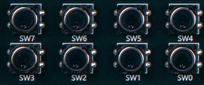
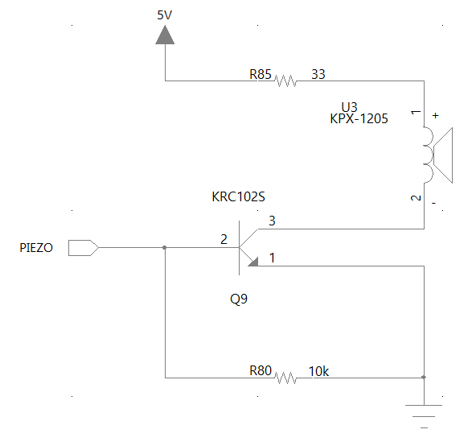
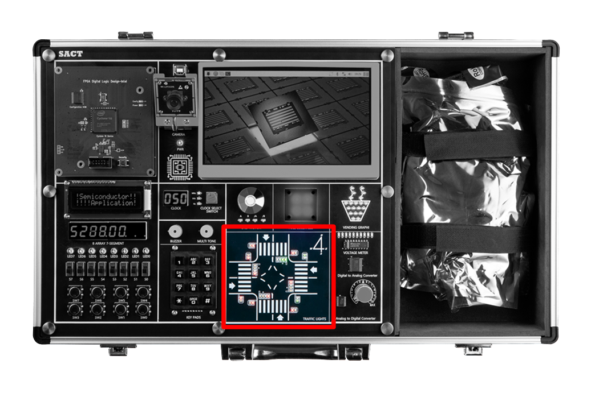

# 반도체 응용 회로 실습 장비 SACT

Hanback Electronics SACT

---

## SACT 

---

## Pin MAP

### 1. Clock Control Block

- Clock configured in 16 steps from 0 Hz to 50 MHz for semiconductor application circuit design is used.

- 0Hz, 1Hz, 10Hz, 50Hz, 100Hz, 500Hz, 1kHz, 5kHz, 10kHz, 50kHz, 100kHz, 500kHz, 1MHz, 5MHz, 25MHz, 50MHz

|No|Frequency||No|Frequency||No|Frequency||No|Frequency|
|:-:|:-:|:-:|:-:|:-:|:-:|:-:|:-:|:-:|:-:|:-:|
|0|0 Hz||1|1 Hz||2|10 Hz||3|50 Hz|
|4|100 Hz||5|500 Hz||6|1 kHz||7|5 kHz|
|8|10 kHz||9|50 kHz||A|100 kHz||B|500 kHz|
|C|1 MHz||D|5 MHz||E|25 MHz||F|25 MHz|

|HARDWARE|Main Clock|
|:-:|:-:|
|PIN NUMBER|G2|

 

### 2. Input

 

#### (1) Slide Switch 

 

As the circuit diagram, default value of '0' is transmitted by the pull-down resistor, and the value of '1' is transmitted when the slide switch is pulled up.

|HARDWARE|S7|S6|S5|S4|S3|S2|S1|S0|
|:-:|:-:|:-:|:-:|:-:|:-:|:-:|:-:|:-:|
|PIN NUMBER|Y6|W7|AB6|AA7|Y7|V8|AB7|Y8|

#### (2) Button Switch 

 

As the circuit diagram, it has a built-in anti-chattering circuit using resistor, capacitor, Schmitt trigger circuit.

When the switch is not pressed, pull-up resistor of the resistor has a value of +3.3V, i.e. '1'. Therefore, it is inverted by 74LCX14 and  '0' is transmitted.

When the switch is pressed, the signal line is connected to GND and switch has a value of '0' and '1' is transmitted by 74LCX14.

74LCX14 IC has a built-in Schmitt trigger circuit, which acts as NOT gate. It is often used to prevent “chattering” that occurs when a button switch is pressed and released.

|HARDWARE|SW7|SW6|SW5|SW4|SW3|SW2|SW1|SW0|
|:-:|:-:|:-:|:-:|:-:|:-:|:-:|:-:|:-:|
|PIN NUMBER|W8|AB8|AA8|V9|U9|AB9|AA9|V10|

#### (3) KEYPADS

 

 

 
As in the circuit, device that can receive input 12 buttons on 3x4 keypad to use is used. All are using pull-down resistors, so all data lines have a value of '0' by default.

It is possible to determine which key was pressed by passing data of [1 0 0 0], [0 1 0 0], [0 0 1 0], [0 0 0 1] to 4-bit KEYPAD_R[3..0] and detecting that what data entered on KEYPAD_C[2..0].

|HARDWARE|KEYPAD_R[3]|KEYPAD_R[2]|KEYPAD_R[1]|KEYPAD_R[0]|
|:-:|:-:|:-:|:-:|:-:|
|PIN NUMBER|AB10|AA10|V11|U11|

|HARDWARE|KEYPAD_C[2]|KEYPAD_C[1]|KEYPAD_C[0]|
|:-:|:-:|:-:|:-:|
|PIN NUMBER|U10|Y10|W10|

 

### 3. Output

#### (1) Buzzer 1ea

 

 

 
It is also called a piezoelectric buzzer makes a beeping sound when a value of 1 is input. 

This is usually used as a warning sound. The circuit is configured as above to implement the current for the buzzer operation.

|HARDWARE|BUZZER|
|:-:|:-:|
|PIN NUMBER|AB13|

#### (2) Multi Tone Buzzer 1ea

 

 

Multi Tone Buzzer (Piezo) uses the same circuit as Buzzer. Unlike the control of a buzzer, separate circuit control is required. When a pulse signal of voice frequency band at the input level corresponding to digital signal 1 is input, sound of the corresponding frequency is output.

Sound is generated only when a frequency corresponding to the sound is input not by simply inputting a value of 1.

Below are the frequencies for the sound/octave to control this device.

|Scale	|2 Octaves |3 Octaves|4 Octaves|
|:-:|:-:|:-:|:-:|
|도|130.8128 Hz|261.6256 Hz|523.2511 Hz|
|레|146.8324 Hz|293.6648 Hz|587.3295 Hz|
|미|164.8138 Hz|329.6276 Hz|659.2551 Hz|
|파|174.6141 Hz|349.2282 Hz|698.4565 Hz|
|솔|195.9977 Hz|391.9954 Hz|783.9909 Hz|
|라|220.0000 Hz|440.0000 Hz|880.0000 Hz|
|시|246.9417 Hz|493.8833 Hz|987.7666 Hz|

|HARDWARE|MULTI TONE BUZZER|
|:-:|:-:|
|PIN NUMBER|AA6|

### 4. Display

  
 

#### (1) LED 8ea

 

Each LED is connected to serial resistor. That is, turn LED on by giving '1' signal.

|HARDWARE|LED7|LED6|LED5|LED4|LED3|LED2|LED1|LED0|
|:-:|:-:|:-:|:-:|:-:|:-:|:-:|:-:|:-:|
|PIN NUMBER|W2|Y1|Y2|Y3|AA3|AB3|Y4|AA4|

#### (2) RGB LED 4ea 

 

The circuit is the same as regular LED. It has 6 pins instead of 2 pins of regular LED because it contains all the colors, red, green, blue in single full-color LED chip. It is configured to control the current through a resistor like regular LED.

|HARDWARE|RGB_R3|RGB_G3|RGB_B3|RGB_R2|RGB_G2|RGB_B1|
|:-:|:-:|:-:|:-:|:-:|:-:|:-:|
|PIN NUMBER|E3|E4|G4|A3|B4|C4|

|HARDWARE|RGB_R1|RGB_G1|RGB_B1|RGB_R0|RGB_G0|RGB_B0|
|:-:|:-:|:-:|:-:|:-:|:-:|:-:|
|PIN NUMBER|G5|B3|C3|A4|B5|E5|

#### (3) 4 Digit 7-Segment 2ea

 

A 4-digit 7-segment display is implemented.

Eight data lines are shared, and the display position is controlled by managing the common terminal of the segment.

|HARDWARE|SEG_COM[7]|SEG_COM[6]|SEG_COM[5]|SEG_COM[4]|
|:-:|:-:|:-:|:-:|:-:|
|PIN NUMBER|U1|T5|T4|T3|

|HARDWARE|SEG_COM[3]|SEG_COM[2]|SEG_COM[1]|SEG_COM[0]|
|:-:|:-:|:-:|:-:|:-:|
|PIN NUMBER|R5|R4|R3|R2|

|HARDWARE|SEG_A|SEG_B|SEG_C|SEG_D|SEG_E|SEG_F|SEG_G|SEG_DP|
|:-:|:-:|:-:|:-:|:-:|:-:|:-:|:-:|:-:|
|PIN NUMBER|R1|P5|P4|R3|P2|P1|N6|N5|

#### (4) 16 x 2 Text LCD

 

Pull-up resistor and Pull-down resistor connected to pin 3 of the Character are used to set the density of characters displayed on the Text LCD in the circuit of the Text LCD. Pin 15 and pin 16 are connected to the backlight power of Text LCD.

|HARDWARE|LCD_RS|LCD_RW|LCD_E|
|:-:|:-:|:-:|:-:|
|PIN NUMBER|N2|N1|M6|

|HARDWARE|LCD_D[7]|LCD_D[6]|LCD_D[5]|LCD_D[4]|
|:-:|:-:|:-:|:-:|:-:|
|PIN NUMBER|J5|J3|L6|M1|

|HARDWARE|LCD_D[3]|LCD_D[2]|LCD_D[1]|LCD_D[0]|
|:-:|:-:|:-:|:-:|:-:|
|PIN NUMBER|M2|M3|M4|M5||

 
### 5. Actuator

#### (1) Step Motor (Status LED 4ea)

 

 
Step motor consumes so much current that it is difficult to control with general I/O, so it is connected through separate IC.

|HARDWARE|STEP_A|STEP_B|STEP_AN|STEP_BN|
|:-:|:-:|:-:|:-:|:-:|
|PIN NUMBER|W6|AB5|AA5|V5|

 
### 6. AD/DA Convertor

#### (1) ADC : Parallel 8-bit, Sampling Speed 1MHz
#### (2) AD In : Volume Resistor(0-+5V)

 

It is an analog to digital converter that changes analog IN values between 0 and 5V into digital data.

The maximum sampling speed used in the equipment is 1MHz, and when ADC_CLK input is received, 0 - 5V data of AD In (Volume Resistor) is output as 12-bit data from ADC_D11 to ADC_D0.
For details, please refer to DATASHEET of ADC used.

|HARDWARE|ADC_CLK|ADC_OTR|ADC_D11|ADC_D10|ADC_D9|ADC_D8|ADC_D7|
|:-:|:-:|:-:|:-:|:-:|:-:|:-:|:-:|
|PIN NUMBER|B6|A6|G7|F7|E7|D7|C7|

|HARDWARE|ADC_D6|ADC_D5|ADC_D4|ADC_D3|ADC_D2|ADC_D1|ADC_D0|
|:-:|:-:|:-:|:-:|:-:|:-:|:-:|:-:|
|PIN NUMBER|B7|A7|F8|E8|D8|C8|B8|

#### (3) DAC : Parallel 8-bit, Sampling Speed 500kHz

 

It is Digital to Analog converter that changes digital data into analog output of 0 - 5V. The maximum sampling speed used in the equipment is 500 kHz.

When CS is 0, the data of DAC_D7 - DAC_D0 is converted to analog data by the signal of WR and output. this output is connected to voltage meter and the output siz is displayed on LED.

|HARDWARE|DAC_CS|DAC_LDACN|DAC_WR|
|:-:|:-:|:-:|:-:|
|PIN NUMBER|A9|E9|F10|

|HARDWARE|DAC_D7|DAC_D6|DAC_D5|DAC_D4|
|:-:|:-:|:-:|:-:|:-:|
|PIN NUMBER|D10|C10|B10|A10|

|HARDWARE|DAC_D3|DAC_D2|DAC_D1|DAC_D0|
|:-:|:-:|:-:|:-:|:-:|
|PIN NUMBER|F11|E11|E12|F13|
  

#### (4) Voltage meter : 0-+5V, Display LED 10ea

 

Device that can check the output result of the DAC, and is configured to output 0-5V analog output to 10 LEDs.

### 7. Application Block

#### (1) Traffic Light 

- Taffic lights at the intersection are expressed and controlled using 32 LEDs.

- It consists of four streets, N (North), E (East), S (South), and W (West).

- Each street consists of four LEDs on the road and two LEDs (two pairs) on the crosswalk.

- A total of 24 I/O controls

 
    
|PORT NAME|N_C_G|N_C_L|N_C_Y|N_C_R|N_W_G|N_W_R|
|:-:|:-:|:-:|:-:|:-:|:-:|:-:|
|PIN NUMBER|W22|V22|Y21|W19|V21|W21|

|PORT NAME|E_C_G|E_C_L|E_C_Y|E_C_R|E_W_G|E_W_R|
|:-:|:-:|:-:|:-:|:-:|:-:|:-:|
|PIN NUMBER|T16|V16|AB16|W17|Y17|U17|

|PORT NAME|S_C_G|S_C_L|S_C_Y|S_C_R|S_W_G|S_W_R|
|:-:|:-:|:-:|:-:|:-:|:-:|:-:|
|PIN NUMBER|AB18|AB19|AB20|AA22|AA16|U16|

|PORT NAME|W_C_G|W_C_L|W_C_Y|W_C_R|W_W_G|W_W_R|
|:-:|:-:|:-:|:-:|:-:|:-:|:-:|
|PIN NUMBER|AA18|AA19|AA20|AA21|W20|Y22|

#### (2) Vending Machine Image

        
- Express the cup filling with water using 20 LEDs

- It consists of 7 lines, there are LEDs on the bottom and controlling the shape of the cup.

- 7 I/O controls

|PORT NAME|VEND_D6|VEND_D5|VEND_D4|VEND_D3|
|:-:|:-:|:-:|:-:|:-:|
|PIN NUMBER|U15|T15|AB14|AA14|

|PORT NAME|VEND_D2|VEND_D1|VEND_D0|
|:-:|:-:|:-:|:-:|
|PIN NUMBER|Y14|W14|V14|

## Assistance Block

- It consists of x86 series PC and 7-inch monitor and camera.

- Display through 7-inch TFT LCD.

 

- Camera Demo for Programmable Logic Device and Assistance Block converged operation	

When pressing CAMERA icon among the icons displayed on TFT LCD, the image received from CAMERA is converted and displayed on TFT LCD according to the pin settings below.

It is configured that a control signal is sent from the Programmable Logic Device, and PC of the Assistance Block receives it and processes the camera image.

 

|PC1|PC0||CAMERA DISPLAY MODE|
|:-:|:-:|:-:|:-:|
|0|0||NOT DISPLAY|
|0|1||RGB Mode|
|1|0||RGB Mode|
|1|1||Canny Mode|

 

|PORT NAME|PC1|PC0|
|:-:|:-:|:-:|
|PIN NUMBER|T17|T19|

 
 
